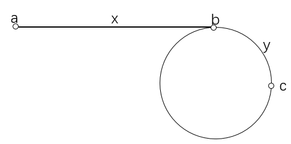

# 142. Linked List Cycle II

直接利用上题第二个思路

假设起点是a点，环的入口是b点，b - a = x
因为有环所以一定会相遇，设相遇点是c且|c - b| = y

用两个指针 first,second 分别从起点开始走，first 每次走一步，seconds 每次走两步。
如果过程中 second 走到null，则说明不存在环。否则当 first 和 second 相遇后，让 first 返回起点，second 待在原地不动，然后两个指针每次分别走一步，当相遇时，相遇点就是环的入口。

证明：如上图所示，a 是起点，b 是环的入口，c 是两个指针的第一次相遇点，ab 之间的距离是 x，bc 之间的距离是 y。
则当 first 走到 b 时，由于 second 比 first 多走一倍的路，所以 second 已经从 b 开始在环上走了 x 步，可能多余1圈，距离 b 还差 y 步（这是因为第一次相遇点在 b 之后 y 步，我们让 first 退回 b 点，则 second 会退 2y 步，也就是距离 b 点还差 y 步）；所以 second 从 b 点走 x+y 步即可回到 b 点，所以 second 从 c 点开始走，走 x 步即可恰好走到 b 点，同时让 first 从头开始走，走 x 步也恰好可以走到 b 点。所以第二次相遇点就是 b 点。
