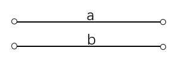

# 160. Intersection of Two Linked Lists

这个比较easy

就两个指针从各个head开始

1. 两个链表不相交：a,b 分别代表两个链表的长度，则两个指针分别走 a+b 步后都变成 null。

2. 两个链表相交：则两个指针分别走 a+b+c 步后在两链表交汇处相遇。

时间复杂度分析：每个指针走的长度不大于两个链表的总长度，所以时间复杂度是 O(n)。
