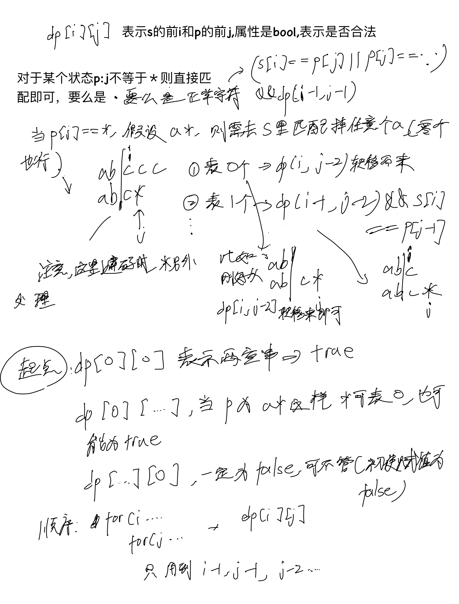
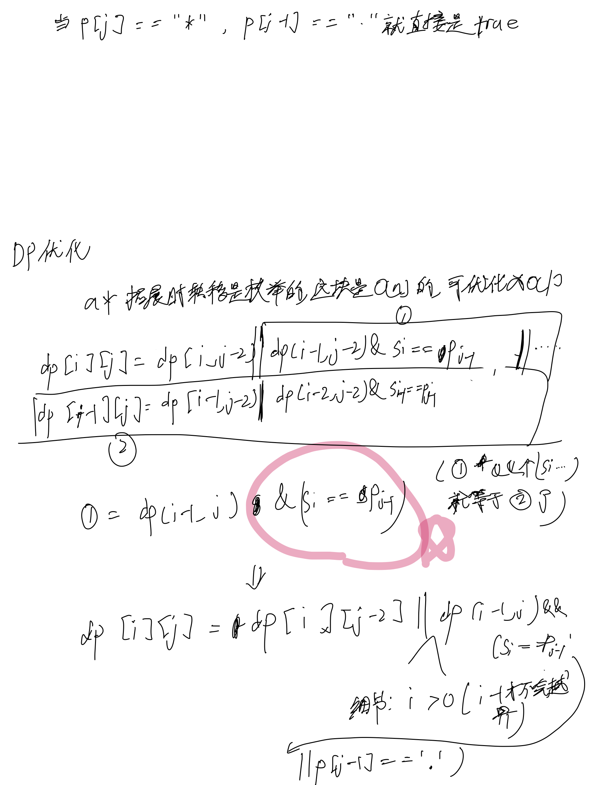
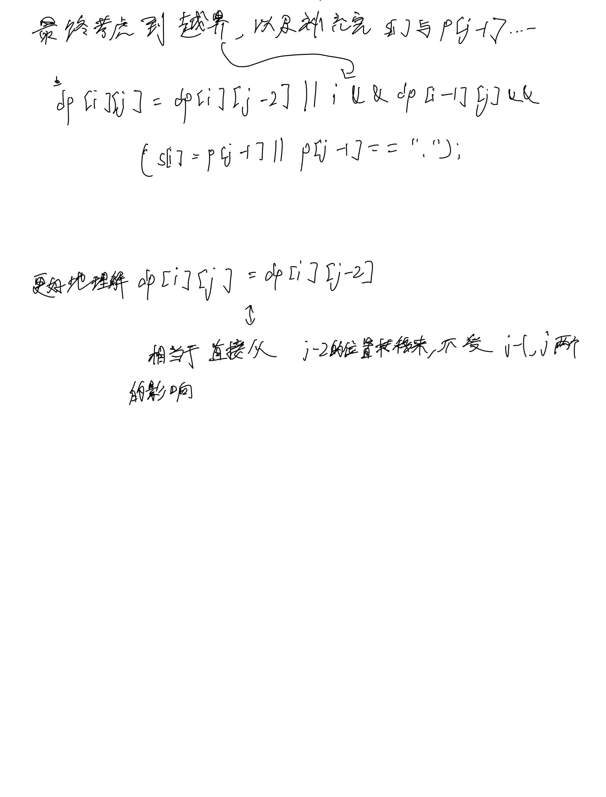

# [10. 正则表达式匹配](https://leetcode.cn/problems/regular-expression-matching/description/)

## 思考





## 代码

```c++
class Solution {
public:
    string delete_star(string p) {
        string t;
        for (int i = 0; i < p.size(); i ++) {
            if (p[i] == '*') {
                t += '*';
                int k = i + 1;
                while (k < p.size() && p[k] == '*') k ++;
                i = k - 1;
            } else {
                t += p[i];
            }
        }
        return t;
    }

    bool isMatch(string s, string p) {
        p = delete_star(p);
        
        int n = s.size(), m = p.size();
        s = ' ' + s, p = ' ' + p;

        vector<vector<bool>> dp(n + 1, vector<bool>(m + 1));

        dp[0][0] = true;

        for (int i = 0; i <= n; i ++) {
            for (int j = 1; j <= m; j ++) {
                if (j + 1 <= m && p[j + 1] == '*') continue; // j落点在star上
                if (i && p[j] != '*') {
                    dp[i][j] = dp[i - 1][j - 1] && (s[i] == p[j] || p[j] == '.');
                } else if (p[j] == '*') {
                    dp[i][j] = dp[i][j - 2] || i && dp[i - 1][j] && (s[i] == p[j - 1] || p[j - 1] == '.'); 
                }
            }
        }

        return dp[n][m];
    }
};
```
