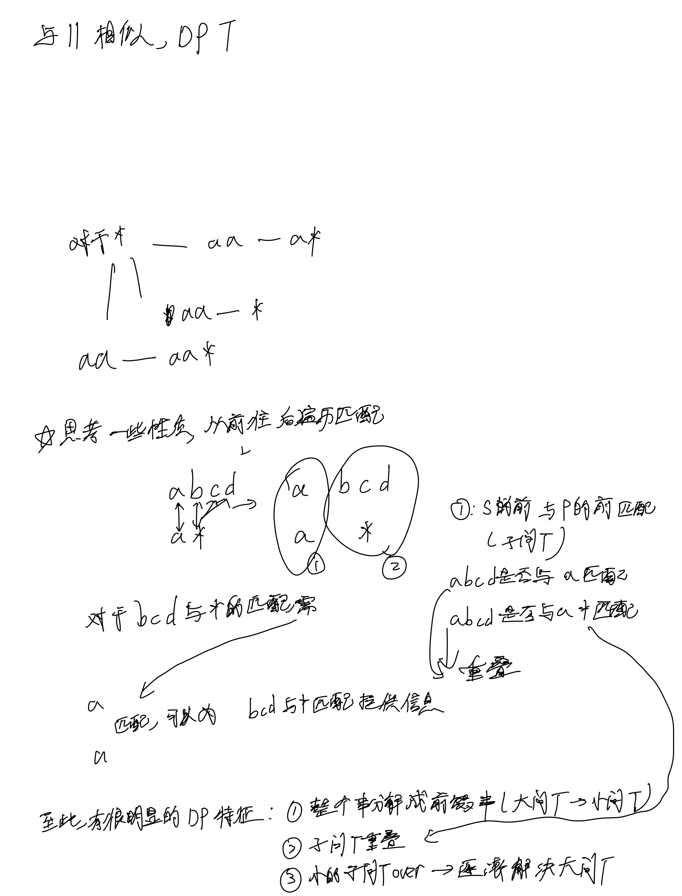
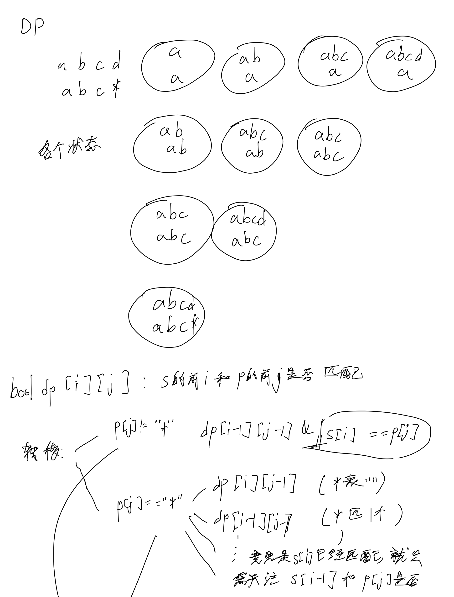
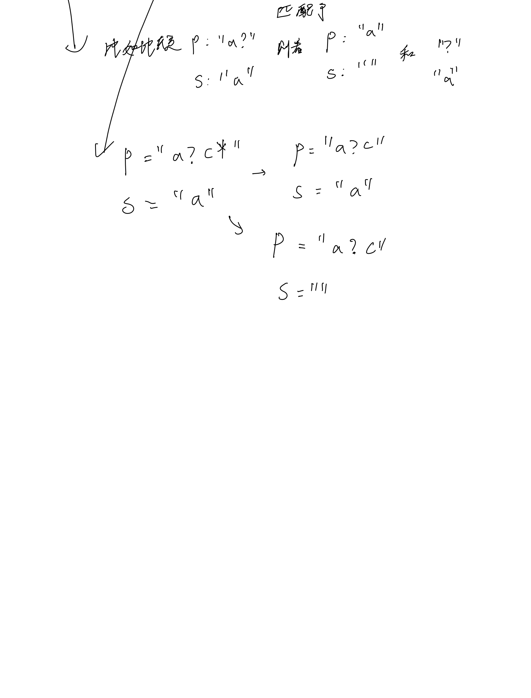
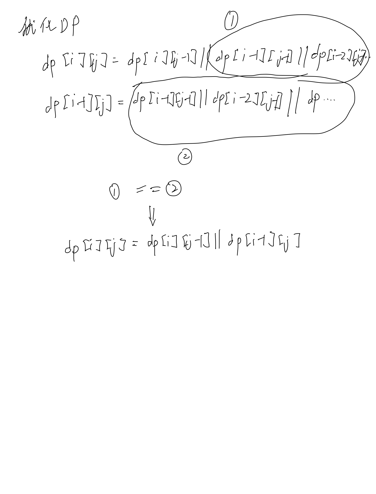

# [44. 通配符匹配](https://leetcode.cn/problems/wildcard-matching/description/)

## 思考






## 代码

```c++
class Solution {
public:
    bool isMatch(string s, string p) {
        int n = s.size(), m = p.size();
        s = ' ' + s, p = ' ' + p;
        vector<vector<bool>> dp(n + 1, vector<bool>(m + 1));

        dp[0][0] = true;
        for (int i = 0; i <= n; i ++) {
            for (int j = 1; j <= m; j ++) {
                if (p[j] != '*') {
                    dp[i][j] = i && dp[i - 1][j - 1] && (s[i] == p[j] || p[j] == '?');
                } else if (p[j] == '*') {
                    dp[i][j] = i && dp[i - 1][j] || dp[i][j - 1];
                }
            }
        }

        return dp[n][m];
    }
};
```
