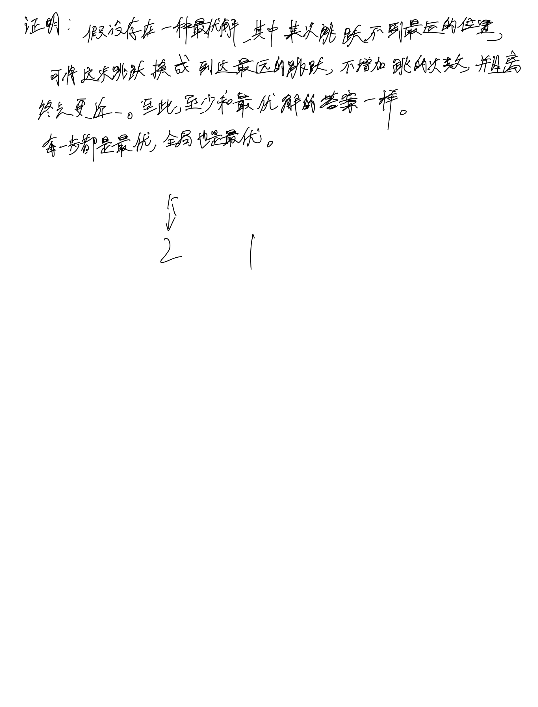

# [45. 跳跃游戏 II](https://leetcode.cn/problems/jump-game-ii/description/)

## 思考




代码上的细节就从前往后遍历一次, pos指向的是本次可跳的最远位置, 所以遍历到pos的时候相当于跳到了pos, 并让计数器++, 每次遍历一个位置更新一下下一跳的最远位置

## 代码

```c++
class Solution {
public:
    int jump(vector<int>& nums) {
        if (nums.size() <= 1) {
            return 0;
        }
        int n = nums.size();

        int cnt = 0;
        int k = 0, pos = min(nums[0] + 0, n - 1), t = -1;
        while (k < n) {
            t = max(t, nums[k] + k);

            if (k == pos) {
                pos = min(n - 1, t);
                cnt ++;
            }
            k ++;
        }
        return cnt; 
    }
};
```
