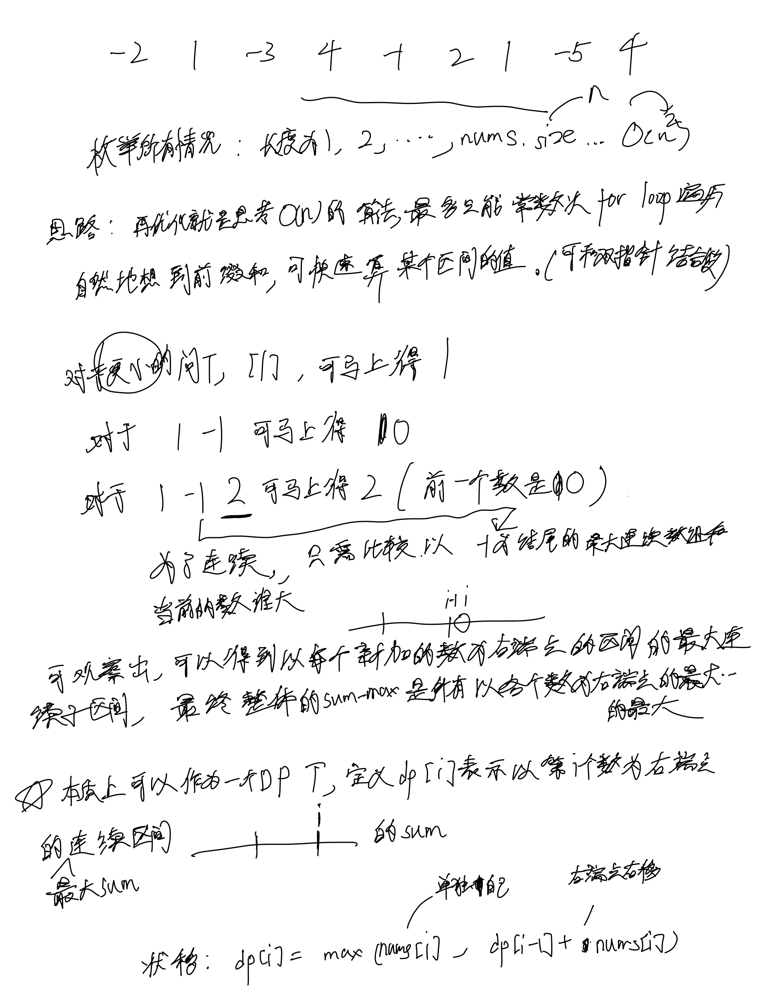
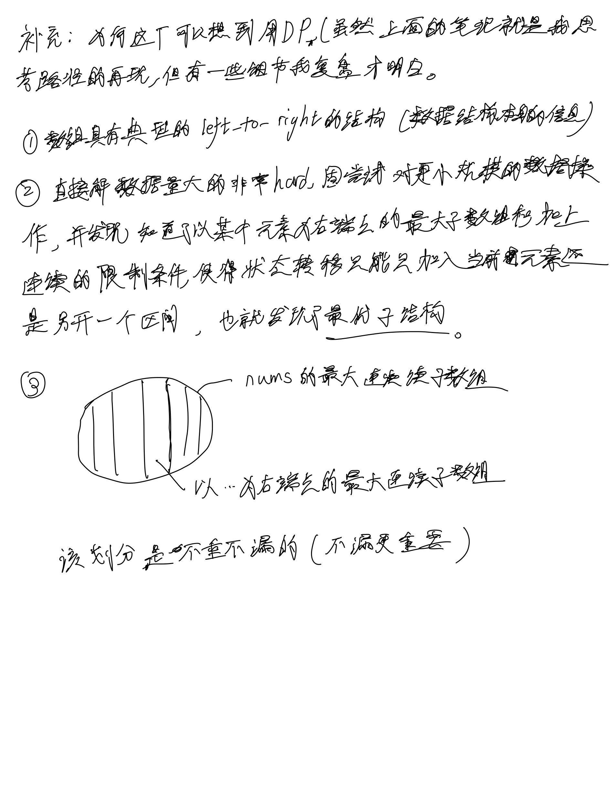
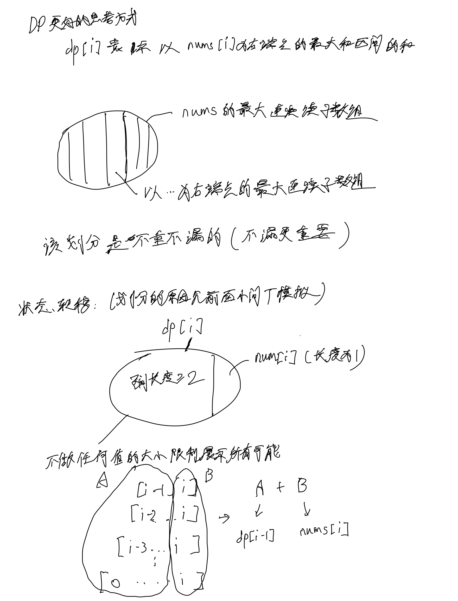
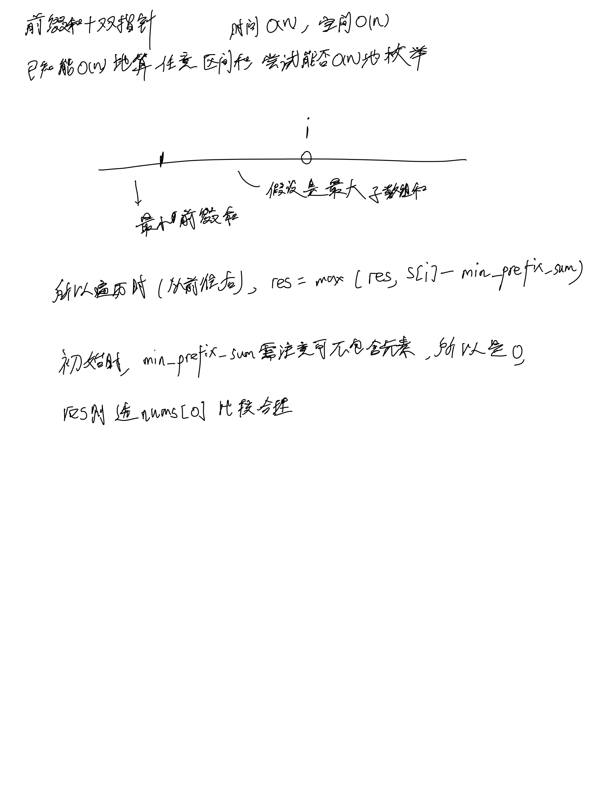
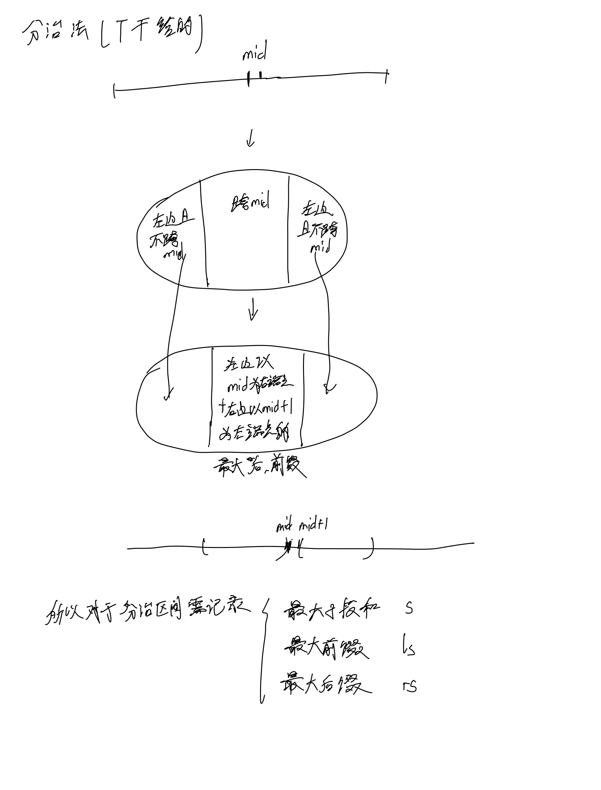
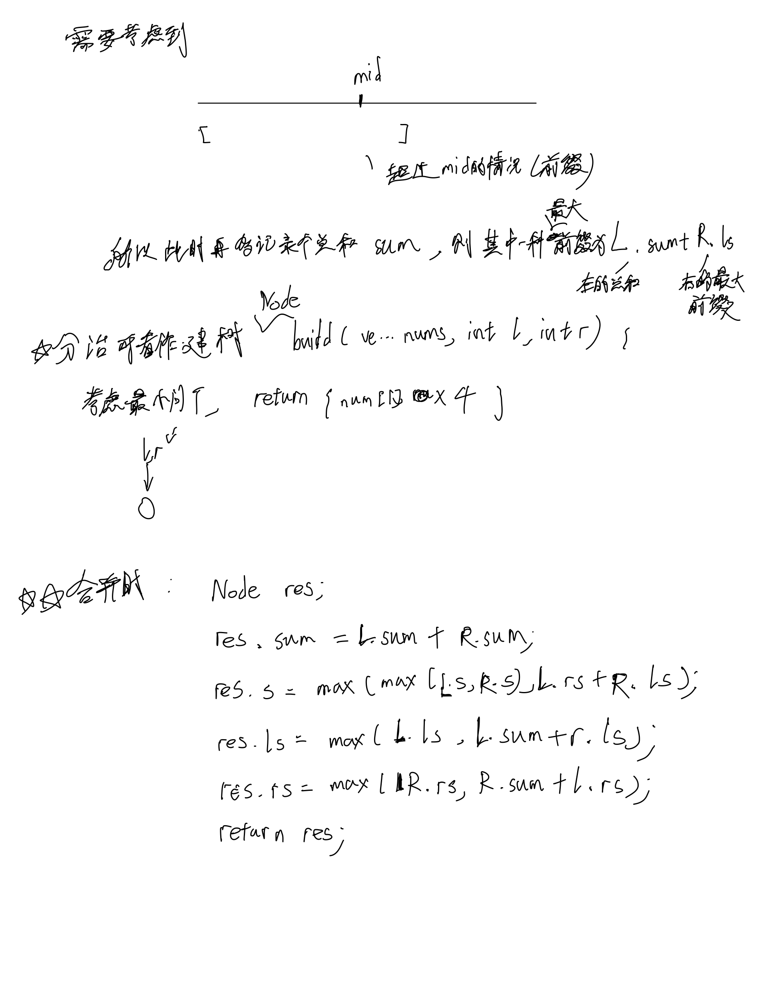

# [53. 最大子数组和](https://leetcode.cn/problems/maximum-subarray/description/)

## 思考

### DP




### DP更好的思考方式



### 前缀+双指针

主要是靠前缀和来获取O(1)的区间信息, 这样再找到计算**最大区间的等价表达式**即可



### 分治法

这题其实分治法需要考虑的点特别多, 处理这题是不精妙的




## 代码

### 未优化空间和常数时间但常规的dp(优点是代码好写)

- 时间: O(n), 空间O(n)

```c++
class Solution {
public:
    int maxSubArray(vector<int>& nums) {
        int n = nums.size();
        vector<int> dp(n);
        
        dp[0] = nums[0];
        for (int i = 1; i < n; i ++) {
            dp[i] = max(nums[i], dp[i - 1] + nums[i]);
        }

        return *max_element(dp.begin(), dp.end());
    }
};
```

### 优化空间和常数时间

- 递推(本质是dp), 在线记录max
- 时间: O(n), 空间O(1)

```c++
class Solution {
public:
    int maxSubArray(vector<int>& nums) {
        int n = nums.size();
        int last = nums[0];
        int res = last;
        for (int i = 1; i < n; i ++) {
            int t = max(last + nums[i], nums[i]);
            res = max(t, res);
            last = t;
        }

        return res;
    }
};
```

### 前缀和+双指针

- 时间: O(n), 空间O(n)

```c++
class Solution {
public:
    int maxSubArray(vector<int>& nums) {
        int n = nums.size();
        vector<int> s(n);
        s[0] = nums[0];
        for (int i = 1; i < n; i ++) {
            s[i] = s[i - 1] + nums[i];
        }

        int res = nums[0], min_prefix_sum = 0;
        for (int i = 0; i < n; i ++) {
            res = max(res, s[i] - min_prefix_sum);
            min_prefix_sum = min(min_prefix_sum, s[i]);
        }

        return res;
    }
};
```

### 分治法

- 时间: O(n), 空间O(logn) (递归层数是logn的)

```c++
class Solution {
public:
    struct Node {
        int sum, s, ls, rs; // 区间总和, 最大子段和, 最大前缀和, 最大后缀和
    };

    Node build(vector<int>& nums, int l, int r) {
        if (l == r) {
            return {nums[l], nums[l], nums[l], nums[l]};
        }

        int mid = (l + r) / 2;
        Node L = build(nums, l, mid), R = build(nums, mid + 1, r);
        Node res;
        res.sum = L.sum + R.sum;
        res.s = max(max(L.s, R.s), L.rs + R.ls);
        res.ls = max(L.ls, L.sum + R.ls);
        res.rs = max(R.rs, R.sum + L.rs);
        return res;
    }

    int maxSubArray(vector<int>& nums) {
        Node res = build(nums, 0, nums.size() - 1);
        return res.s;
    }
};
```

### 线段树

未完待续
