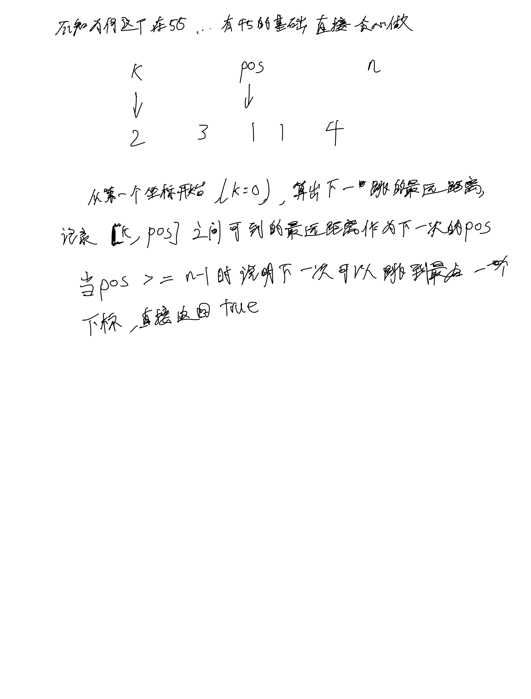

# [55. 跳跃游戏](https://leetcode.cn/problems/jump-game/description/)

## 思考



## 代码

```c++
class Solution {
public:
    bool canJump(vector<int>& nums) {
        if (nums.size() <= 1) {
            return true;
        }
        int n = nums.size();

        int k = 0, pos = min(nums[0] + 0, n - 1), t = -1;
        while (k < n) {
            t = max(t, nums[k] + k);

            if (k == pos) {
                pos = t;
                if (pos >= n - 1) return true;
            }
            k ++;
        }

        return false; 
    }
};
```
