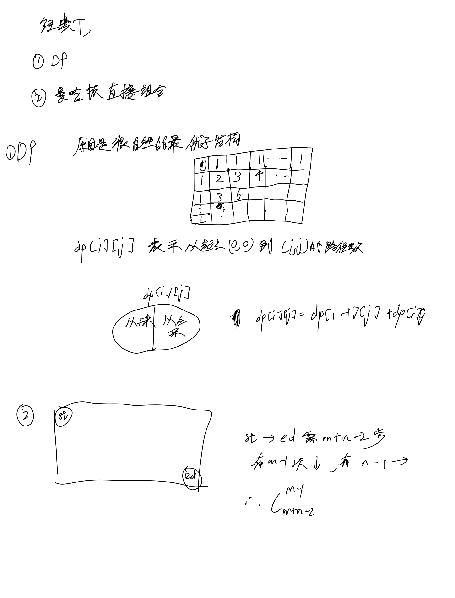
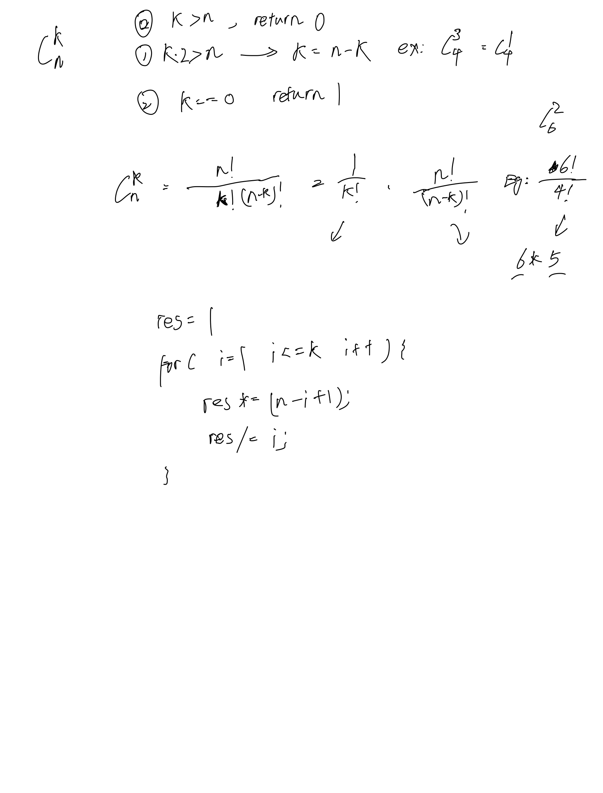

# [62. 不同路径](https://leetcode.cn/problems/unique-paths/description/)

## 思考




## 代码

### DP

```c++
class Solution {
public:
    int uniquePaths(int m, int n) {
        vector<vector<int>> f(m, vector<int>(n));
        f[0][0] = 1;
        for (int i = 1; i < n; i ++) {
            f[0][i] = 1;
        }

        for (int i = 1; i < m; i ++) {
            f[i][0] = 1;
        }

        for (int i = 1; i < m; i ++) {
            for (int j = 1; j < n; j ++) {
                f[i][j] = f[i - 1][j] + f[i][j - 1];
            }
        }

        return f[m - 1][n - 1];
    }
};
```

### 组合数学

```c++
class Solution {
public:
    unsigned nck(unsigned n, unsigned k) {
        if (k > n) return 0;
        if (k * 2 > n) k = n - k;
        if (!k) return 1;

        unsigned long res = 1;
        for (int i = 1; i <= k; i ++) {
            res = res * (n - i + 1) / i;
        }

        return res;
    }
    int uniquePaths(int m, int n) {
        int res = nck(m + n - 2, m - 1);
        return res;
    }
};
```
