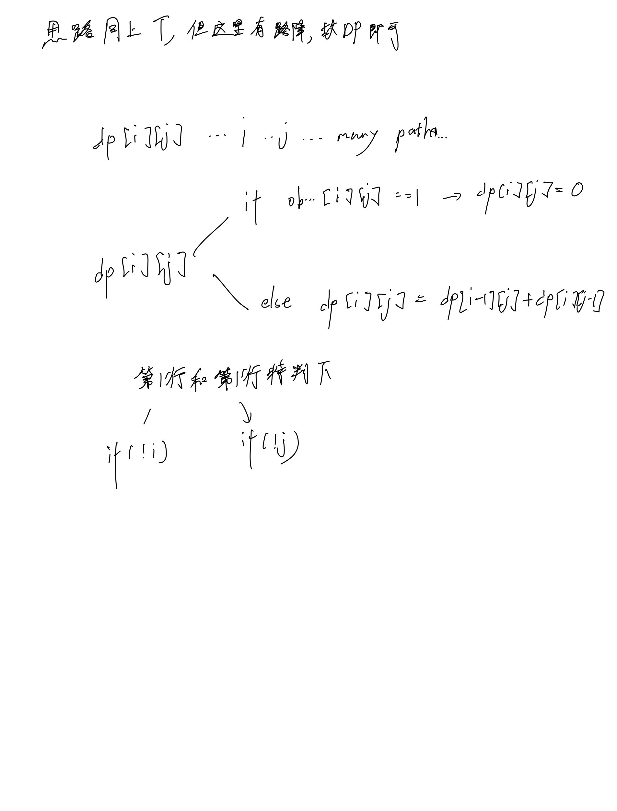

# [63. 不同路径 II](https://leetcode.cn/problems/unique-paths-ii/)

## 思考



## 代码

```c++
class Solution {
public:
    int uniquePathsWithObstacles(vector<vector<int>>& obstacleGrid) {
        int m = obstacleGrid.size(), n = obstacleGrid[0].size();
        vector<vector<int>> dp(m + 1, vector<int>(n + 1, 0));
        for (int i = 0; i < m; i ++) {
            for (int j = 0; j < n; j ++) {
                if (obstacleGrid[i][j]) {
                    dp[i][j] = 0;
                    continue;
                }
                if (!i && !j) 
                {
                    dp[i][j] = 1;
                    continue;
                }
                if (!i) {
                    dp[i][j] = dp[i][j - 1];
                    continue;
                }
                if (!j) {
                    dp[i][j] = dp[i - 1][j];
                    continue;
                }

                dp[i][j] = dp[i - 1][j] + dp[i][j - 1];
            }
        }

        return dp[m - 1][n - 1];
    }
};
```
