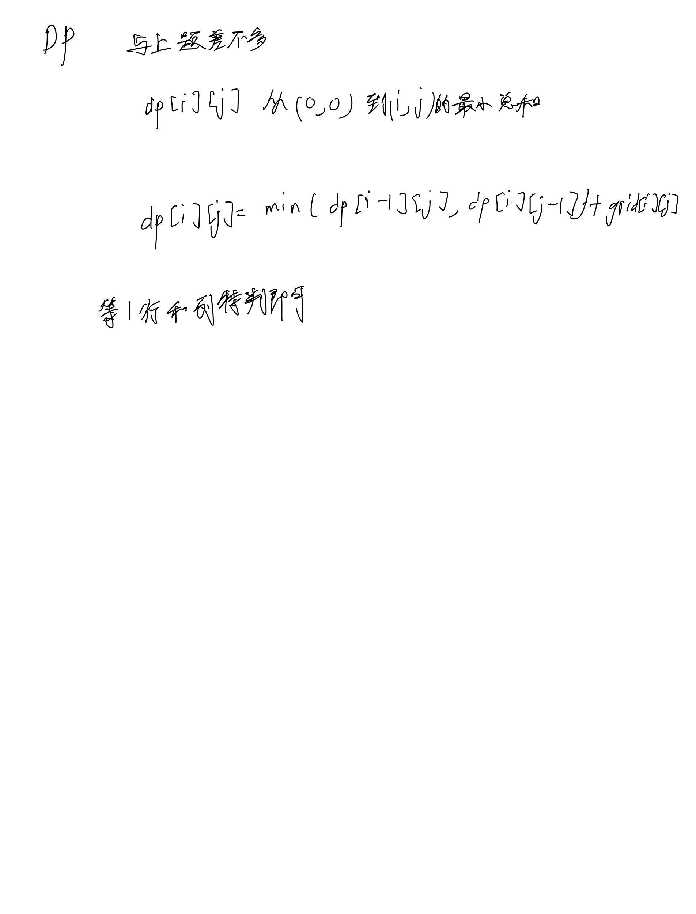

# [64. 最小路径和](https://leetcode.cn/problems/minimum-path-sum/description/)

## 思考



## 代码

```c++
class Solution {
public:
    int minPathSum(vector<vector<int>>& grid) {
        int m = grid.size(), n = grid[0].size();
        vector<vector<int>> dp(m, vector<int>(n, 0));

        for (int i = 0; i < m; i ++) {
            for (int j = 0; j < n; j ++) {
                if (!i && !j) {
                    dp[i][j] = grid[i][j];
                    continue;
                }
                if (!i) {
                    dp[i][j] = grid[i][j] + dp[i][j - 1];
                    continue;
                }
                if (!j) {
                    dp[i][j] = grid[i][j] + dp[i - 1][j];
                    continue;
                }
                dp[i][j] = min(dp[i - 1][j], dp[i][j - 1]) + grid[i][j];
            }
        }

        return dp[m -  1][n - 1];
    }
};
```
