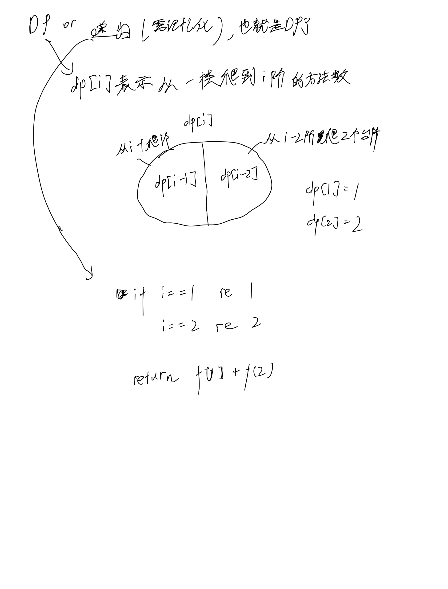

# [70. 爬楼梯](https://leetcode.cn/problems/climbing-stairs/description/)

## 思考



## 代码

### DP

```c++
class Solution {
public:
    int climbStairs(int n) {
        vector<int> dp(n + 2);
        dp[1] = 1;
        dp[2] = 2;
        for (int i = 3; i <= n; i ++) {
            dp[i] = dp[i - 1] + dp[i - 2];
        }

        return dp[n];
    }
};
```

### 记忆化递归

```c++
class Solution {
public:
    unordered_map<int, int> d;

    int f(int x) {
        if (x == 1) return d[1];
        if (x == 2) return d[2];
        if (d[x]) return d[x];

        return d[x] = f(x - 1) + f(x - 2);
    }

    int climbStairs(int n) {
        d[1] = 1;
        d[2] = 2;
        return f(n);
    }
};
```
