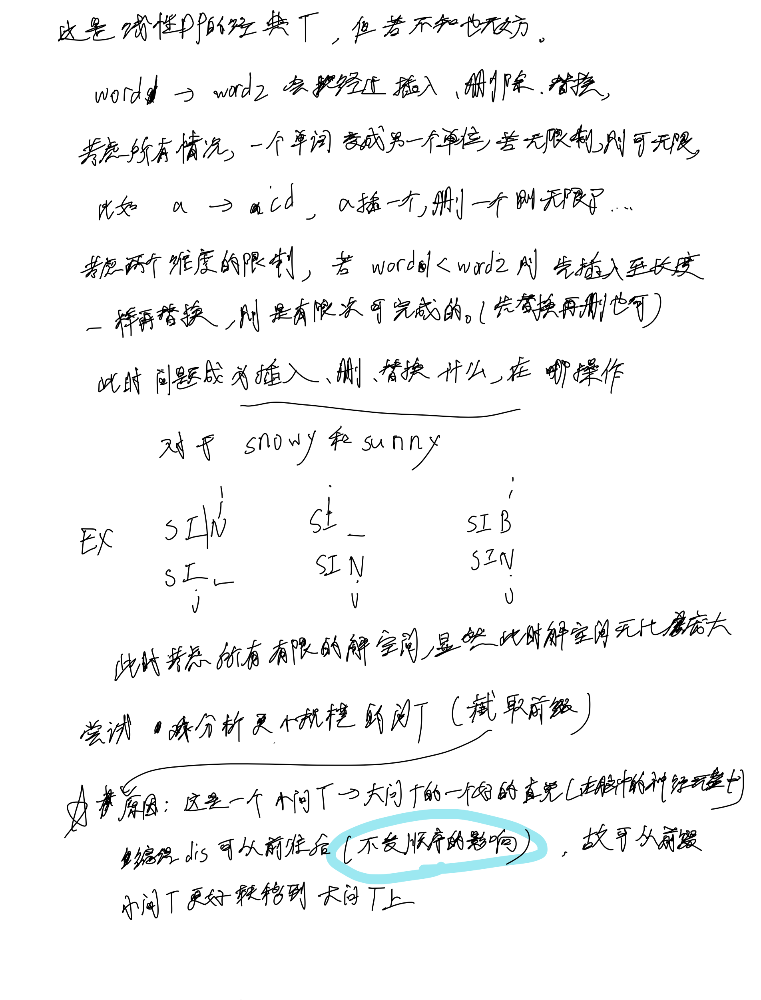
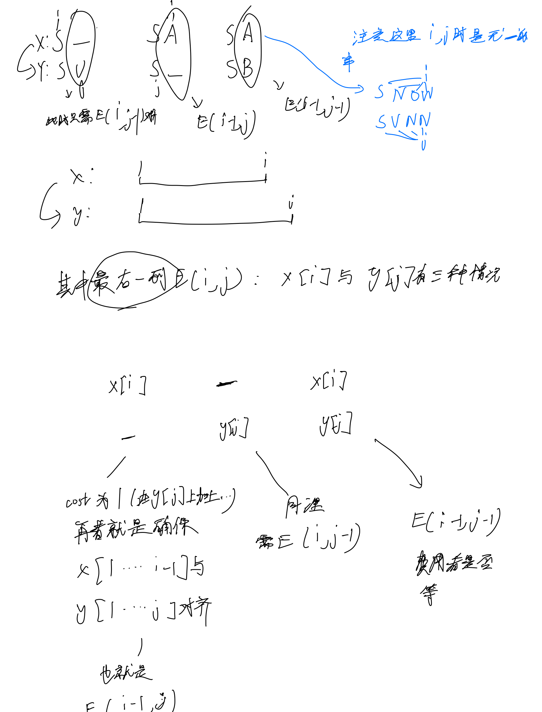
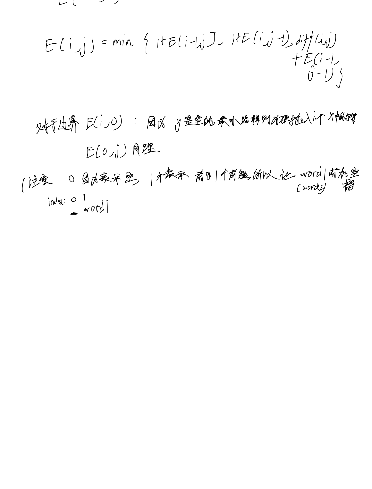

# [72. 编辑距离](https://leetcode.cn/problems/edit-distance/)

## 思考





## 代码

```c++
class Solution {
public:

    int diff(char x, char y) {
        if (x == y) return 0;
        return 1;
    }

    int minDistance(string word1, string word2) {
        int n = word1.size(), m = word2.size();
        word1 = " " + word1;
        word2 = " " + word2;
        vector<vector<int>> dp(n + 1, vector<int>(m + 1));
        for (int i = 0; i <= n; i ++) {
            dp[i][0] = i;
        }

        for (int i = 1; i <= m; i ++) {
            dp[0][i] = i;
        }

        for (int i = 1; i <= n; i ++) {
            for (int j = 1; j <= m; j ++) {
                dp[i][j] = min(1 + dp[i - 1][j], 1 + dp[i][j - 1]);
                dp[i][j] = min(dp[i][j], diff(word1[i], word2[j]) + dp[i - 1][j - 1]);
            }
        }

        return dp[n][m];
    }
};
```
