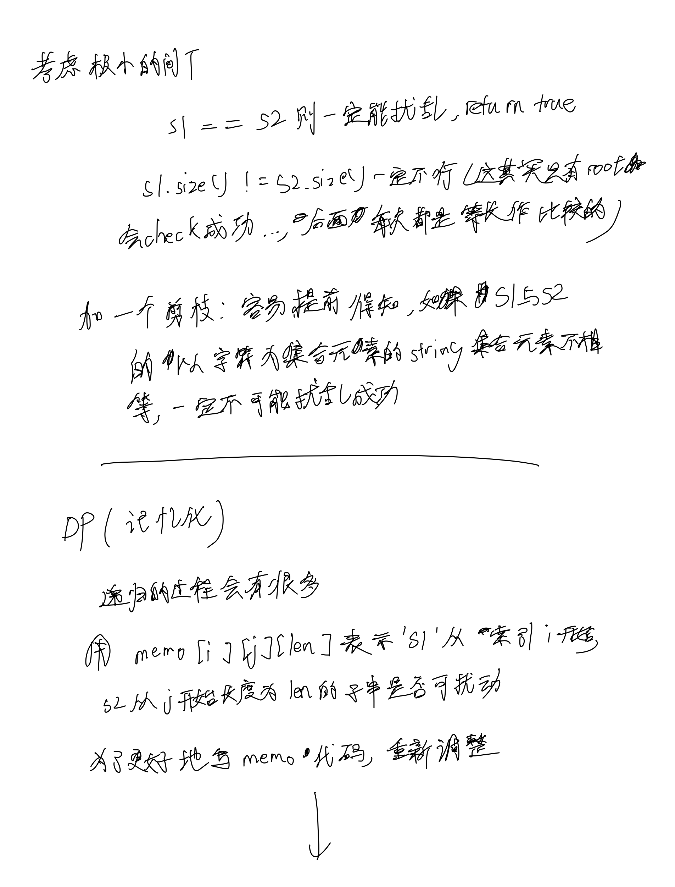

# [87. 扰乱字符串](https://www.acwing.com/video/1431/)

## 思考

- 这题的题面貌似改了, 现在直接是给的类似模拟题的思路且告知了可用递归写





## 代码

### 普通的递归(会超时)

```c++
class Solution {
public:
    bool isScramble(string s1, string s2) {
        if (s1.size() != s2.size()) return false;
        if (s1 == s2) return true;
        string t1 = s1;
        string t2 = s2;
        sort(t1.begin(), t1.end());
        sort(t2.begin(), t2.end());
        if (t1 != t2) return false;
        int n = s1.size();

        for (int i = 1; i <= n - 1; i ++) {
            string s11 = s1.substr(0, i);
            string s12 = s1.substr(i, n - i);
            string s21 = s2.substr(0, i);
            string s22 = s2.substr(i, n - 1);

            if (isScramble(s11, s21) && isScramble(s12, s22)) {
                return true;
            }
            s21 = s2.substr(0, n - i);
            s22 = s2.substr(n - i, i);
            if (isScramble(s12, s21) && isScramble(s11, s22)) {
                return true;
            }
        }
        return false;
    }
};
```

### DP(记忆化)

```c++
class Solution {
public:
    bool isScramble_helper(const string& s1, const string& s2, int i, int j, int len, vector<vector<vector<int>>> &memo) {
        if (memo[i][j][len] != -1) return memo[i][j][len];
        if (s1.substr(i, len) == s2.substr(j, len)) {
            memo[i][j][len] = 1;
            return true;
        }
        string t1 = s1.substr(i, len), t2 = s2.substr(j, len);
        sort(t1.begin(), t1.end());
        sort(t2.begin(), t2.end());
        if (t1 != t2) {
            memo[i][j][len] = 0;
            return false;
        }

        for (int k = 1; k < len; k ++) {
            if (isScramble_helper(s1, s2, i, j, k, memo) && isScramble_helper(s1, s2, i + k, j + k, len - k, memo)) {
                memo[i][j][len] = 1;
                return true;
            }

            if (isScramble_helper(s1, s2, i, j + len - k, k, memo) && isScramble_helper(s1, s2, i + k, j, len - k, memo)) {
                memo[i][j][len] = 1;
                return true;
            }
        }

        memo[i][j][len] = 0;
        return false;
    }

    bool isScramble(string s1, string s2) {
        if (s1.size() != s2.size()) return false;
        if (s1 == s2) return true;
        string t1 = s1;
        string t2 = s2;
        sort(t1.begin(), t1.end());
        sort(t2.begin(), t2.end());
        if (t1 != t2) return false;
        int n = s1.size();

        vector<vector<vector<int>>> memo(n, vector<vector<int>>(n, vector<int>(n + 1, -1)));

        return isScramble_helper(s1, s2, 0, 0, n, memo);
    }
};
```

### DP(递推)

```c++
class Solution {
public:
    bool isScramble(string s1, string s2) {
        if (s1.size() != s2.size()) {
            return false;
        }
        if (s1 == s2) {
            return true;
        }
        string t1 = s1, t2 = s2;
        sort(t1.begin(), t1.end());
        sort(t2.begin(), t2.end());
        if (t1 != t2)
            return false;
        int n = s1.size();

        vector<vector<vector<bool>>> dp(n, vector(n, vector(n + 1, false)));

        for (int k = 1; k <= n; k ++) {
            for (int i = 0; i + k - 1 < n; i ++) {
                for (int j = 0; j + k - 1 < n; j ++) {
                    if (k == 1) {
                        if (s1[i] == s2[j]) {
                            dp[i][j][k] = true;
                        } 
                    } else {
                        for (int u = 1; u <= k - 1; u ++) {
                            if (dp[i][j][u] && dp[i + u][j + u][k - u] || dp[i + u][j][k - u] && dp[i][j + k - u][u]) {
                                dp[i][j][k] = true;
                                break;
                            }
                        }
                    }
                }
            }
        }

        return dp[0][0][n];
    }
};
```
