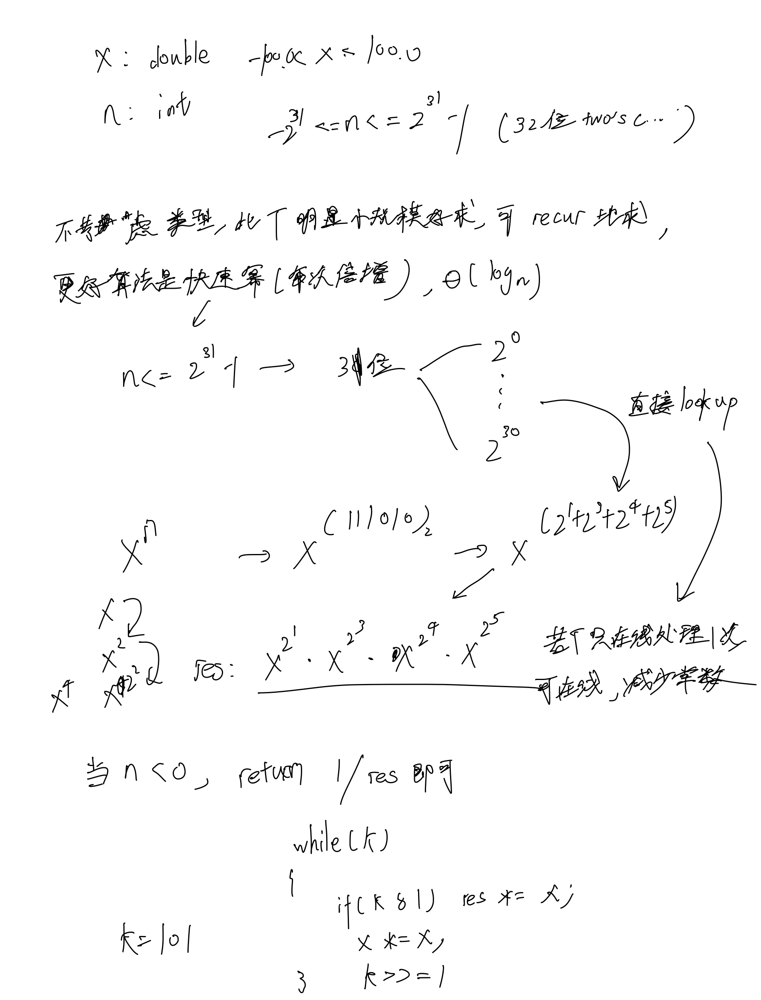

# [50. Pow(x, n)](https://leetcode.cn/problems/powx-n/description/)

## 思考



## 代码

```c++
class Solution {
public:
    double myPow(double x, int n) {
        bool is_minus = n < 0;
        int k = abs(n);
        double res = 1.0;
        
        while (k) {
            if (k & 1) res *= x;
            x *= x;
            k >>= 1;
        }
        if (is_minus) {
            res = 1 / res;
        }

        return res;
    }
};
```
