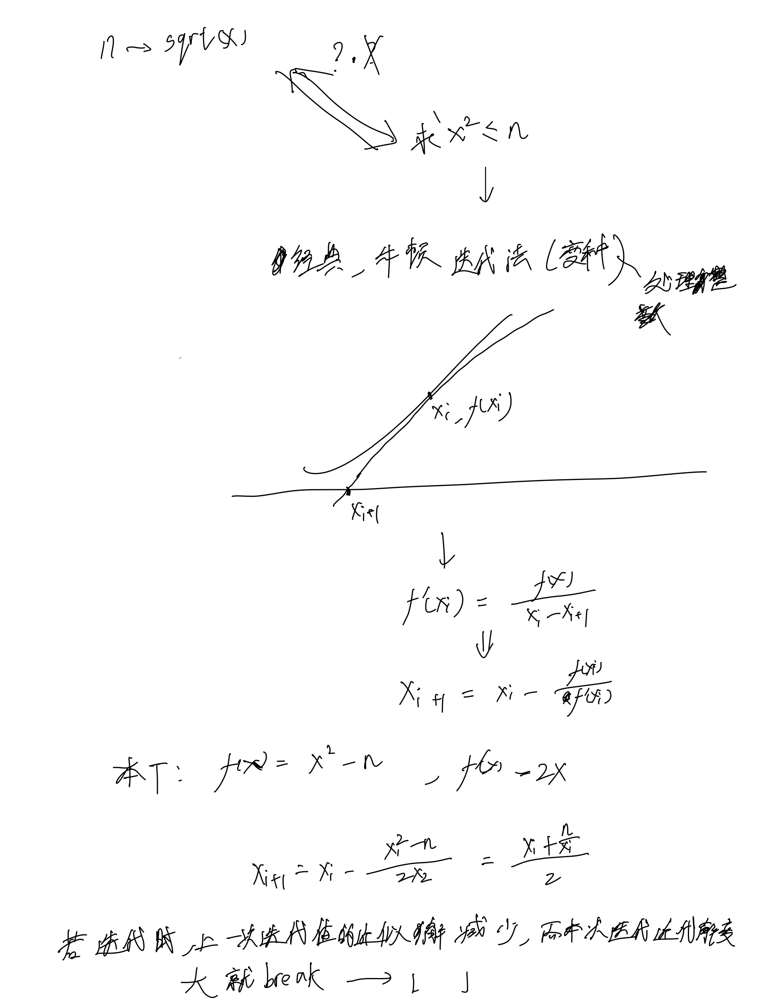
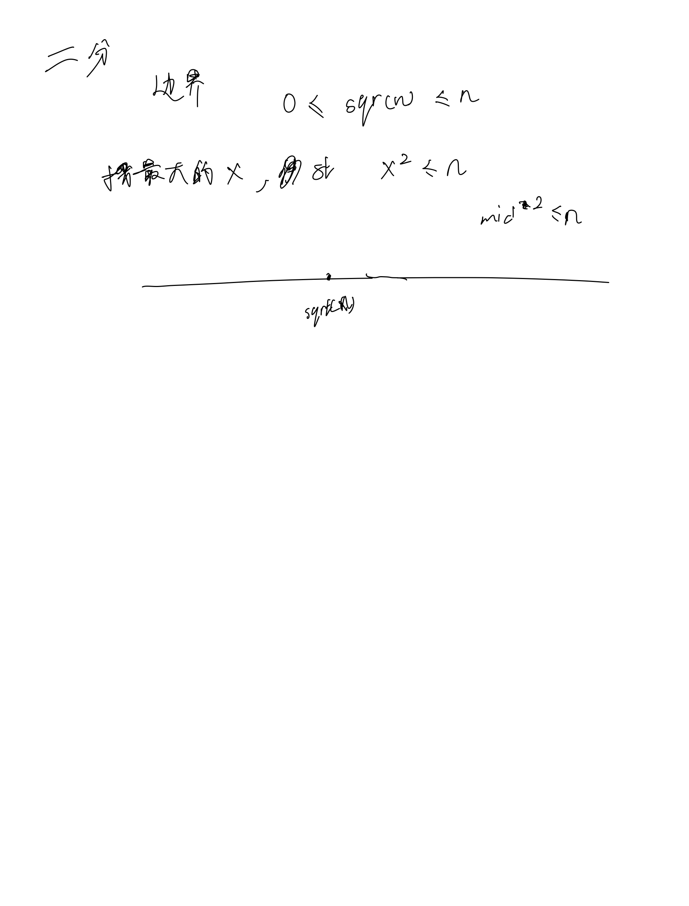

# [69. x 的平方根](https://leetcode.cn/problems/sqrtx/description/)

## 思考




## 代码

### 牛顿迭代法

```c++
class Solution {
public:
    int mySqrt(int n) {
        if (n == 0) return 0;
        long x = 1;
        bool decreased = false;
        while (true) {
            double nx = (x + n / x) / 2;
            if (x == nx || decreased && nx > x) break;
            decreased = nx < x;
            x = nx;
        }
        return x;
    }
};
```

### 二分

```c++
class Solution {
public:
    int mySqrt(int n) {
        int l = 0, r = n;
        while (l < r) {
            int mid = (l + 1ll + r) / 2; // 1ll是有超过int的数据, 此时l + 1ll是long类型的, / 2结果一定小于INT_MAX
            if (mid <= n / mid) {
                l = mid;
            } else {
                r = mid - 1;
            }
        }

        return r;
    }
};```
