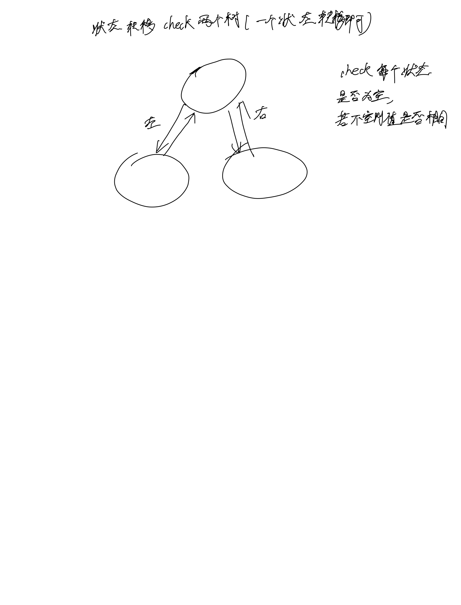

# [100. 相同的树](https://leetcode.cn/problems/same-tree/description/)

## 思考



## 代码

### DFS

#### C++

```c++
/**
 * Definition for a binary tree node.
 * struct TreeNode {
 *     int val;
 *     TreeNode *left;
 *     TreeNode *right;
 *     TreeNode() : val(0), left(nullptr), right(nullptr) {}
 *     TreeNode(int x) : val(x), left(nullptr), right(nullptr) {}
 *     TreeNode(int x, TreeNode *left, TreeNode *right) : val(x), left(left), right(right) {}
 * };
 */
class Solution {
public:
    bool isSameTree(TreeNode* p, TreeNode* q) {
        if (!p && !q) {
            return true;
        }
        if (!p || !q) {
            return false;
        }
        if (p->val != q->val) {
            return false;
        }

        bool res = isSameTree(p->left, q->left) && isSameTree(p->right, q->right);
        return res;
    }
};
```

#### c

```c
/**
 * Definition for a binary tree node.
 * struct TreeNode {
 *     int val;
 *     struct TreeNode *left;
 *     struct TreeNode *right;
 * };
 */
bool isSameTree(struct TreeNode* p, struct TreeNode* q) {
        if (!p && !q) {
            return true;
        }
        if (!p || !q) {
            return false;
        }
        if (p->val != q->val) {
            return false;
        }

        bool res = isSameTree(p->left, q->left) && isSameTree(p->right, q->right);
        return res;
}
```
