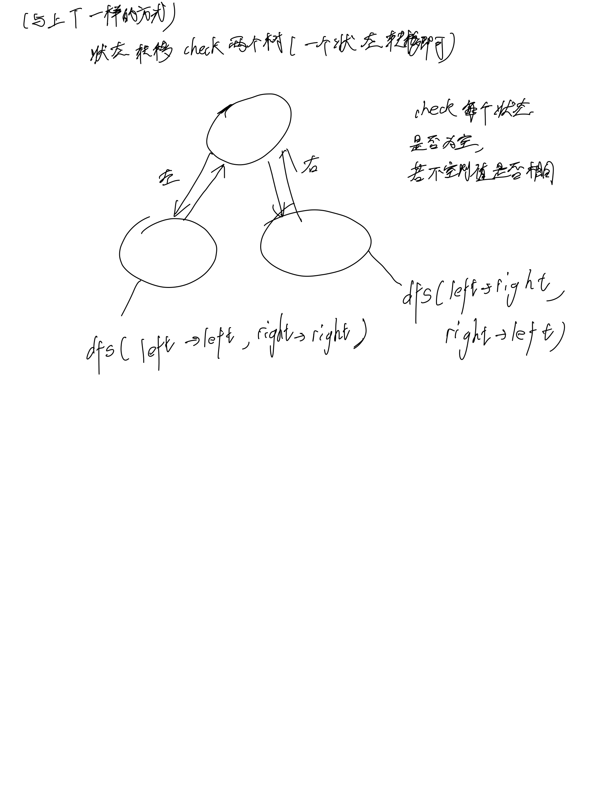

# [101. 对称二叉树](https://leetcode.cn/problems/symmetric-tree/)

## 思考



## 代码

### DFS

#### C++

```c++
/**
 * Definition for a binary tree node.
 * struct TreeNode {
 *     int val;
 *     TreeNode *left;
 *     TreeNode *right;
 *     TreeNode() : val(0), left(nullptr), right(nullptr) {}
 *     TreeNode(int x) : val(x), left(nullptr), right(nullptr) {}
 *     TreeNode(int x, TreeNode *left, TreeNode *right) : val(x), left(left), right(right) {}
 * };
 */
class Solution {
public:
    bool dfs(TreeNode* left, TreeNode* right) {
        if (!left && !right) {
            return true;
        }
        if (!left || !right) {
            return false;
        }
        if (left->val != right->val) {
            return false;
        }

        if (dfs(left->left, right->right) && dfs(left->right, right->left)) {
            return true;
        }

        return false;
    }

    bool isSymmetric(TreeNode* root) {
        if (!root) {
            return true;
        }
        return dfs(root->left, root->right);
    }
};
```

#### C

```c
/**
 * Definition for a binary tree node.
 * struct TreeNode {
 *     int val;
 *     struct TreeNode *left;
 *     struct TreeNode *right;
 * };
 */

bool dfs(struct TreeNode* left, struct TreeNode* right) {
    if (!left && !right) {
        return true;
    }
    if (!left || !right) {
        return false;
    }
    if (left->val != right->val) {
        return false;
    }

    if (dfs(left->left, right->right) && dfs(left->right, right->left)) {
        return true;
    }

    return false;
}

bool isSymmetric(struct TreeNode* root) {
    return dfs(root->left, root->right);
}
```
