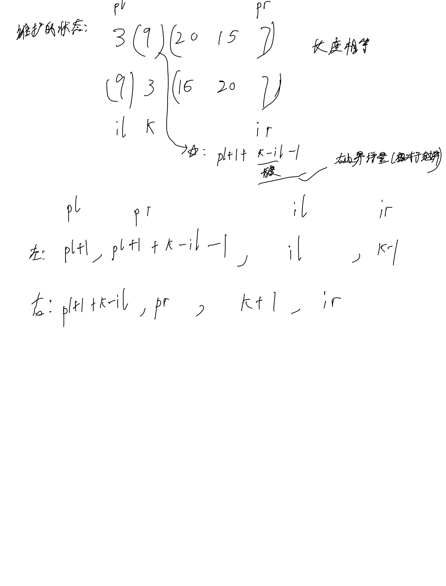

# [105. 从前序与中序遍历序列构造二叉树](https://leetcode.cn/problems/construct-binary-tree-from-preorder-and-inorder-traversal/description/)

## 思考




## 代码

### DFS

#### C++

注意为了准备复试故意没有使用unordered_map, 而是使用offset做一个映射

```c++
/**
 * Definition for a binary tree node.
 * struct TreeNode {
 *     int val;
 *     TreeNode *left;
 *     TreeNode *right;
 *     TreeNode() : val(0), left(nullptr), right(nullptr) {}
 *     TreeNode(int x) : val(x), left(nullptr), right(nullptr) {}
 *     TreeNode(int x, TreeNode *left, TreeNode *right) : val(x), left(left), right(right) {}
 * };
 */
class Solution {
public:
    int offset = 3000;
    vector<int> pos;
    TreeNode* dfs(vector<int>& preorder, vector<int>& inorder, int pl, int pr, int il, int ir) {
        if (pl > pr) {
            return NULL;
        }
        TreeNode* p = new TreeNode(preorder[pl]);
        int k = pos[p->val + offset];
        p->left = dfs(preorder, inorder, pl + 1, pl + 1 + k - il - 1, il , k - 1);
        p->right = dfs(preorder, inorder, pl + 1 + k - il, pr, k + 1, ir);

        return p;
    }
    TreeNode* buildTree(vector<int>& preorder, vector<int>& inorder) {
        int n = preorder.size();
        pos = vector<int>(6000, -1);
        for (int i = 0; i < n; i ++) {
            pos[inorder[i] + offset] = i;
        }
        return dfs(preorder, inorder, 0, n - 1, 0, n - 1);
    }
};
```

#### C

```c
/**
 * Definition for a binary tree node.
 * struct TreeNode {
 *     int val;
 *     struct TreeNode *left;
 *     struct TreeNode *right;
 * };
*/

const int offset = 3000;
int pos[6000];

struct TreeNode* dfs(int* preorder, int preorderSize, int* inorder, int inorderSize, int pl, int pr, int il, int ir) {
    if (pl > pr) {
        return NULL;
    }
    struct TreeNode* p = (struct TreeNode*)malloc(sizeof(struct TreeNode));
    p->val = preorder[pl];
    int k = pos[p->val + offset];
    p->left = dfs(preorder, preorderSize, inorder, inorderSize, pl + 1, pl + 1 + k - il - 1, il , k - 1);
    p->right = dfs(preorder, preorderSize, inorder, inorderSize, pl + 1 + k - il, pr, k + 1, ir);

    return p;
}

struct TreeNode* buildTree(int* preorder, int preorderSize, int* inorder, int inorderSize) {
    memset(pos, -1, sizeof pos);
    for (int i = 0; i < inorderSize; i ++) {
        pos[inorder[i] + offset] = i;
    }
    return dfs(preorder, preorderSize, inorder, inorderSize, 0, preorderSize - 1, 0, preorderSize - 1);    
}
```
