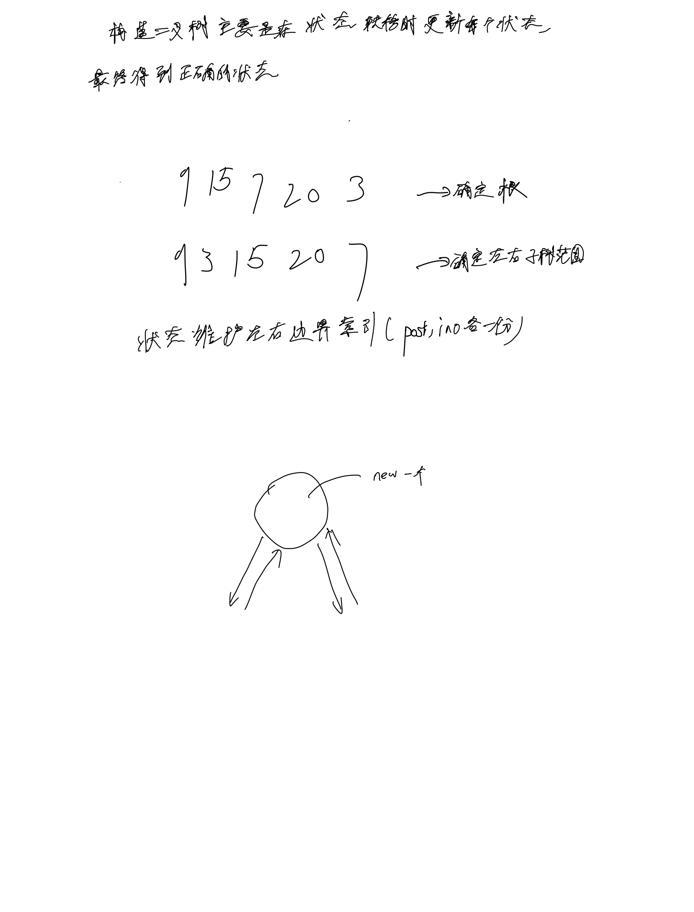
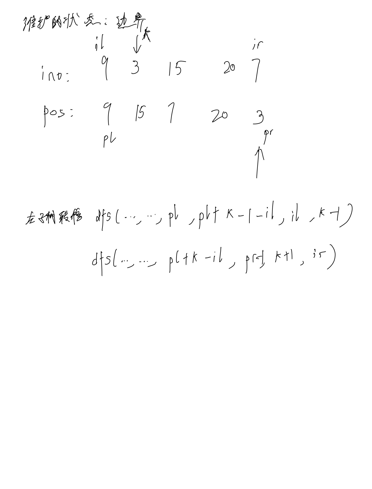

# [106. 从中序与后序遍历序列构造二叉树](https://leetcode.cn/problems/construct-binary-tree-from-inorder-and-postorder-traversal/description/)

## 思考

与上题差不多




## 代码

### DFS

#### C++

```c++
/**
 * Definition for a binary tree node.
 * struct TreeNode {
 *     int val;
 *     TreeNode *left;
 *     TreeNode *right;
 *     TreeNode() : val(0), left(nullptr), right(nullptr) {}
 *     TreeNode(int x) : val(x), left(nullptr), right(nullptr) {}
 *     TreeNode(int x, TreeNode *left, TreeNode *right) : val(x), left(left), right(right) {}
 * };
 */
class Solution {
public:
    int offset = 3000;
    vector<int> pos;

    TreeNode* dfs(vector<int>& inorder, vector<int>& postorder, int pl, int pr, int il, int ir) {
        if (pl > pr) {
            return NULL;
        }
        int t = postorder[pr];
        TreeNode* p = new TreeNode(t);
        int k = pos[t + offset];
        p->left = dfs(inorder, postorder, pl, pl + k - 1 - il, il, k - 1);
        p->right = dfs(inorder, postorder, pl + k - il, pr - 1, k + 1, ir);

        return p;
    }

    TreeNode* buildTree(vector<int>& inorder, vector<int>& postorder) {
        int n = postorder.size();
        pos = vector<int>(6000, -1);
        for (int i = 0; i < n; i ++) {
            pos[inorder[i] + offset] = i;
        }

        return dfs(inorder, postorder, 0, n - 1, 0, n - 1);
    }
};
```

#### C

```c
/**
 * Definition for a binary tree node.
 * struct TreeNode {
 *     int val;
 *     struct TreeNode *left;
 *     struct TreeNode *right;
 * };
 */
const int offset = 3000;
int pos[6000];

struct TreeNode* dfs(int* inorder, int* postorder, int pl, int pr, int il, int ir) {
    if (pl > pr) {
        return NULL;
    }

    int t = postorder[pr];
    struct TreeNode* p = malloc(sizeof(struct TreeNode));
    p->val = t;
    int k = pos[t + offset];
    p->left = dfs(inorder, postorder, pl, pl + k - 1 - il, il, k - 1);
    p->right = dfs(inorder, postorder, pl + k - il, pr - 1, k + 1, ir);
    
    return p;
}

struct TreeNode* buildTree(int* inorder, int inorderSize, int* postorder, int postorderSize) {
    int n = inorderSize;
    memset(pos, -1, sizeof pos);
    for (int i = 0; i < n; i ++) {
        pos[inorder[i] + offset] = i;
    }

    return dfs(inorder, postorder, 0, n - 1, 0, n - 1);
}
```
