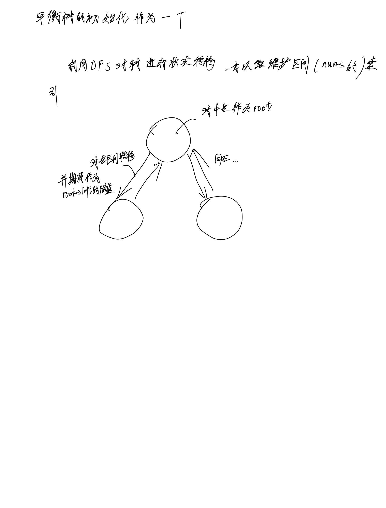

# [108. 将有序数组转换为二叉搜索树](https://leetcode.cn/problems/convert-sorted-array-to-binary-search-tree/description/)

## 思考



## 代码

### DFS

#### C++

```c++
/**
 * Definition for a binary tree node.
 * struct TreeNode {
 *     int val;
 *     TreeNode *left;
 *     TreeNode *right;
 *     TreeNode() : val(0), left(nullptr), right(nullptr) {}
 *     TreeNode(int x) : val(x), left(nullptr), right(nullptr) {}
 *     TreeNode(int x, TreeNode *left, TreeNode *right) : val(x), left(left), right(right) {}
 * };
 */
class Solution {
public:
    TreeNode* dfs(vector<int>& nums, int l, int r) {
        if (l > r) {
            return NULL;
        }
        int mid = l + (r - l) / 2;
        TreeNode* p = new TreeNode(nums[mid]);
        p->left = dfs(nums, l, mid - 1);
        p->right = dfs(nums, mid + 1, r);

        return p;
    }
    TreeNode* sortedArrayToBST(vector<int>& nums) {
        return dfs(nums, 0, nums.size() - 1);
    }
};
```

#### C

```c
/**
 * Definition for a binary tree node.
 * struct TreeNode {
 *     int val;
 *     struct TreeNode *left;
 *     struct TreeNode *right;
 * };
 */
struct TreeNode* dfs(int* nums, int l, int r) {
    if (l > r) {
        return NULL;
    }
    int mid = l + (r - l) / 2;
    struct TreeNode* p = malloc(sizeof(struct TreeNode));
    p->val = nums[mid];
    p->left = dfs(nums, l, mid - 1);
    p->right = dfs(nums, mid + 1, r);
    return p;
}
struct TreeNode* sortedArrayToBST(int* nums, int numsSize) {
    return dfs(nums, 0, numsSize - 1);
}
```
