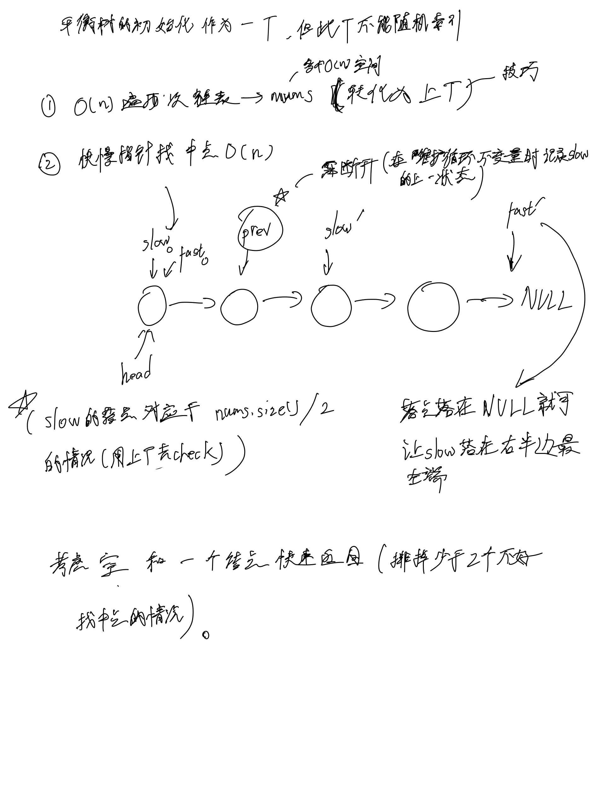
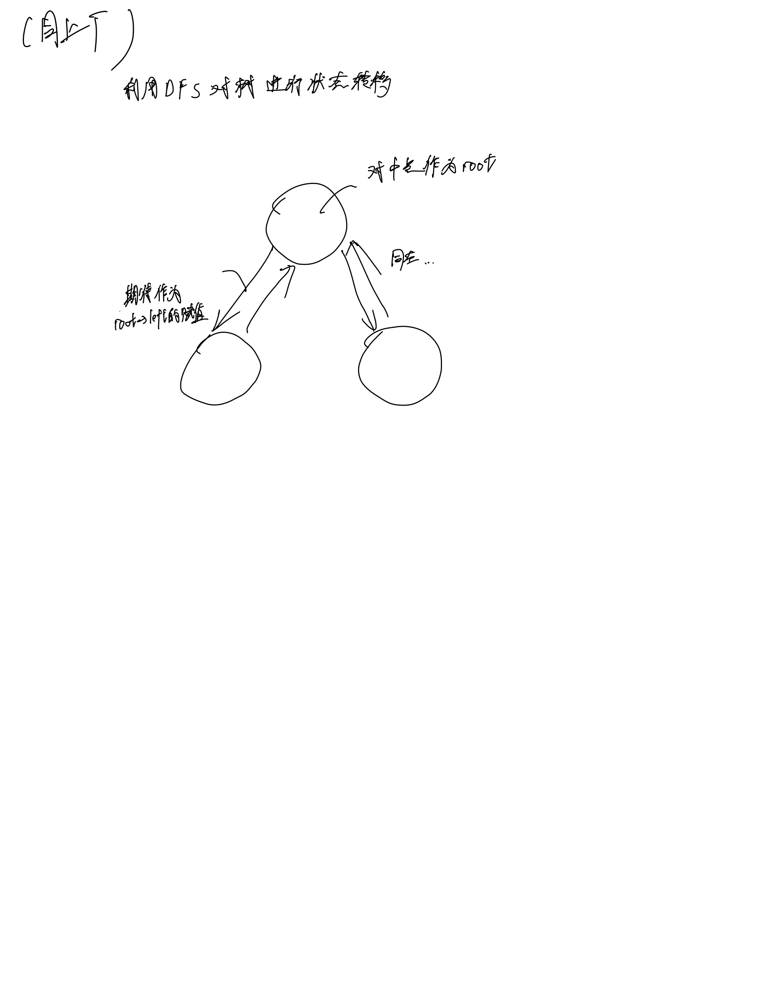

# [109. 有序链表转换二叉搜索树](https://leetcode.cn/problems/convert-sorted-list-to-binary-search-tree/)

## 思考




## 代码

### 转化为上题

#### C++

```c++
/**
 * Definition for singly-linked list.
 * struct ListNode {
 *     int val;
 *     ListNode *next;
 *     ListNode() : val(0), next(nullptr) {}
 *     ListNode(int x) : val(x), next(nullptr) {}
 *     ListNode(int x, ListNode *next) : val(x), next(next) {}
 * };
 */
/**
 * Definition for a binary tree node.
 * struct TreeNode {
 *     int val;
 *     TreeNode *left;
 *     TreeNode *right;
 *     TreeNode() : val(0), left(nullptr), right(nullptr) {}
 *     TreeNode(int x) : val(x), left(nullptr), right(nullptr) {}
 *     TreeNode(int x, TreeNode *left, TreeNode *right) : val(x), left(left), right(right) {}
 * };
 */
class Solution {
public:
    TreeNode* dfs(vector<int>& nums, int l, int r) {
        if (l > r) {
            return NULL;
        }
        int mid = l + (r - l) / 2;
        TreeNode* p = new TreeNode(nums[mid]);
        p->left = dfs(nums, l, mid - 1);
        p->right = dfs(nums, mid + 1, r);

        return p;
    }
    TreeNode* sortedListToBST(ListNode* head) {
        vector<int> nums;
        for (ListNode* p = head; p; p = p->next) {
            nums.push_back(p->val);
        }
        return dfs(nums, 0, nums.size() - 1);
    }
};
```

#### C

```c
/**
 * Definition for singly-linked list.
 * struct ListNode {
 *     int val;
 *     struct ListNode *next;
 * };
 */
/**
 * Definition for a binary tree node.
 * struct TreeNode {
 *     int val;
 *     struct TreeNode *left;
 *     struct TreeNode *right;
 * };
 */
struct TreeNode* dfs(int* nums, int l, int r) {
    if (l > r) {
        return NULL;
    }
    int mid = l + (r - l) / 2;
    struct TreeNode* p = malloc(sizeof(struct TreeNode));
    p->val = nums[mid];
    p->left = dfs(nums, l, mid - 1);
    p->right = dfs(nums, mid + 1, r);
    return p;
}
struct TreeNode* sortedListToBST(struct ListNode* head) {
    int nums[20000];
    int numsSize = 0;
    for (struct ListNode* p = head; p; p = p->next) {
        nums[numsSize ++] = p->val;
    }
    return dfs(nums, 0, numsSize - 1);
}
```

### 快慢指针

#### C++

```c++
/**
 * Definition for singly-linked list.
 * struct ListNode {
 *     int val;
 *     ListNode *next;
 *     ListNode() : val(0), next(nullptr) {}
 *     ListNode(int x) : val(x), next(nullptr) {}
 *     ListNode(int x, ListNode *next) : val(x), next(next) {}
 * };
 */
/**
 * Definition for a binary tree node.
 * struct TreeNode {
 *     int val;
 *     TreeNode *left;
 *     TreeNode *right;
 *     TreeNode() : val(0), left(nullptr), right(nullptr) {}
 *     TreeNode(int x) : val(x), left(nullptr), right(nullptr) {}
 *     TreeNode(int x, TreeNode *left, TreeNode *right) : val(x), left(left), right(right) {}
 * };
 */
class Solution {
public:
    TreeNode* dfs(ListNode* head) {
        if (!head) {
            return {};
        }
        if (!head->next) {
            return new TreeNode(head->val);
        }

        ListNode* slow = head, *fast = head, *prev = NULL;
        while (fast && fast->next) {
            prev = slow;
            slow = slow->next;
            fast = fast->next->next;
        }
        prev->next = NULL;

        TreeNode* p = new TreeNode(slow->val);
        p->left = dfs(head);
        p->right = dfs(slow->next);

        return p;
    }
    TreeNode* sortedListToBST(ListNode* head) {
        return dfs(head);
    }
};
```

#### C

```c
/**
 * Definition for singly-linked list.
 * struct ListNode {
 *     int val;
 *     struct ListNode *next;
 * };
 */
/**
 * Definition for a binary tree node.
 * struct TreeNode {
 *     int val;
 *     struct TreeNode *left;
 *     struct TreeNode *right;
 * };
 */
struct TreeNode* dfs(struct ListNode* head) {
    if (!head) {
        return NULL;
    }
    if (!head->next) {
        struct TreeNode* p = malloc(sizeof(struct TreeNode));
        p->val = head->val;
        p->left = NULL;
        p->right = NULL;
        return p;
    }
    struct ListNode* prev = NULL, *slow = head, *fast = head;
    while (fast && fast->next) {
        prev = slow;
        slow = slow->next;
        fast = fast->next->next;
    }
    prev->next = NULL;

    struct TreeNode* p = malloc(sizeof(struct TreeNode));
    p->val = slow->val;
    p->left = dfs(head);
    p->right = dfs(slow->next);

    return p;
}

struct TreeNode* sortedListToBST(struct ListNode* head) {
    return dfs(head);
}
```
