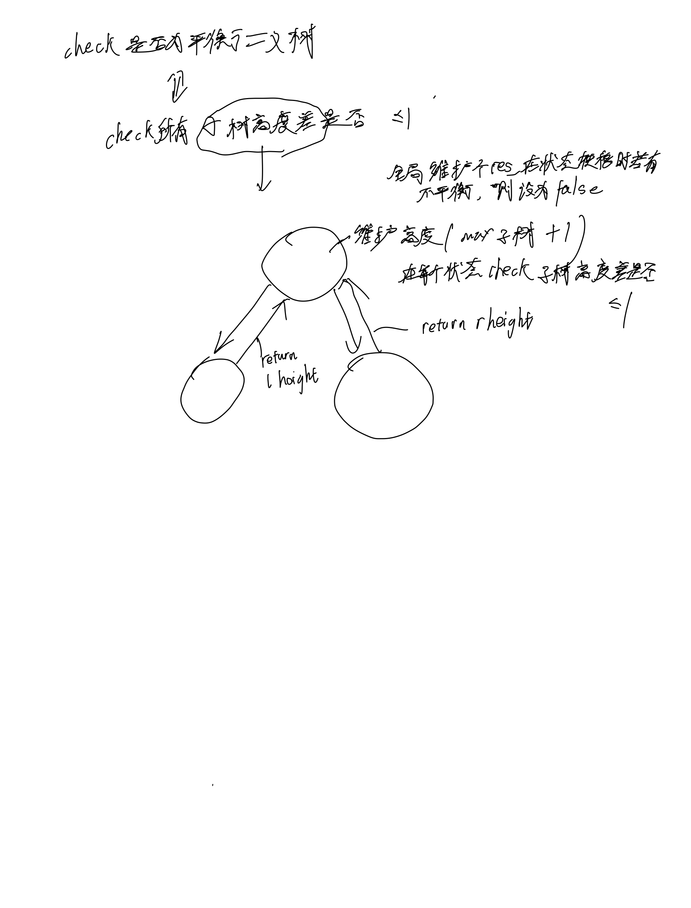

# [110. 平衡二叉树](https://leetcode.cn/problems/balanced-binary-tree/description/)

## 思考



## 代码

### DFS

#### C++

```c++
/**
 * Definition for a binary tree node.
 * struct TreeNode {
 *     int val;
 *     struct TreeNode *left;
 *     struct TreeNode *right;
 * };
 */
bool res;

int dfs(struct TreeNode* root) {
    if (!root) {
        return 0;
    }
    int l = dfs(root->left), r = dfs(root->right);
    if (abs(l - r) > 1) {
        res = false;
    }
    return fmax(l, r) + 1;
}

bool isBalanced(struct TreeNode* root) {
    res = true;
    dfs(root);
    return res;
}
```

#### C

```c
/**
 * Definition for a binary tree node.
 * struct TreeNode {
 *     int val;
 *     TreeNode *left;
 *     TreeNode *right;
 *     TreeNode() : val(0), left(nullptr), right(nullptr) {}
 *     TreeNode(int x) : val(x), left(nullptr), right(nullptr) {}
 *     TreeNode(int x, TreeNode *left, TreeNode *right) : val(x), left(left), right(right) {}
 * };
 */
class Solution {
public:
    bool res;
    int dfs(TreeNode* root) {
        if (!root) return 0;
        int l = dfs(root->left), r = dfs(root->right);
        if (abs(l - r) > 1) {
            res = false;
        }
        return max(l, r) + 1;
    }

    bool isBalanced(TreeNode* root) {
        res = true;
        dfs(root);
        return res;
    }
};
```
