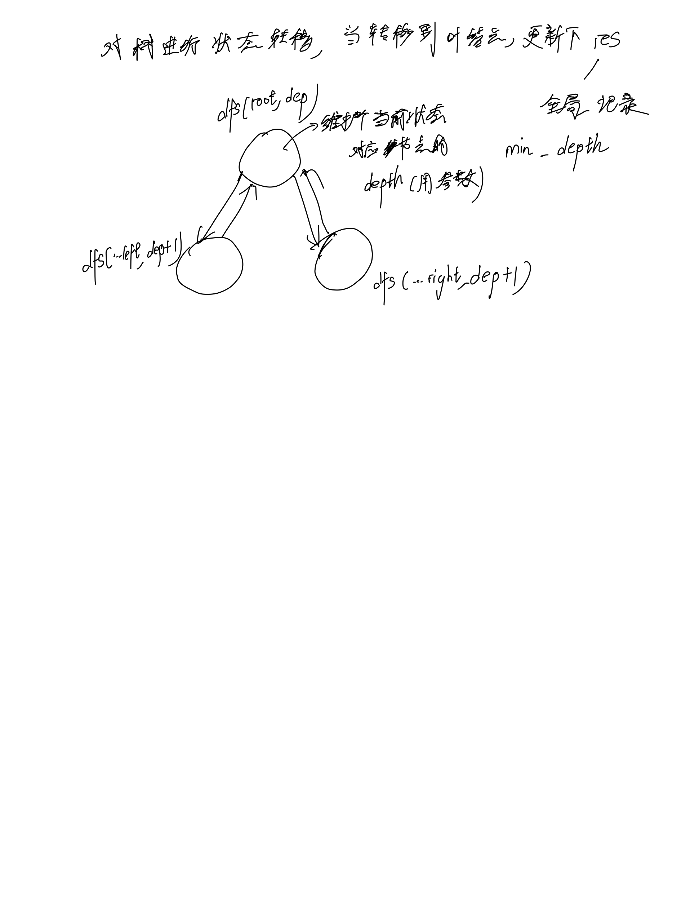

# [111. 二叉树的最小深度](https://leetcode.cn/problems/minimum-depth-of-binary-tree/description/)

## 思考



## 代码

### DFS

#### C++

```c++
/**
 * Definition for a binary tree node.
 * struct TreeNode {
 *     int val;
 *     TreeNode *left;
 *     TreeNode *right;
 *     TreeNode() : val(0), left(nullptr), right(nullptr) {}
 *     TreeNode(int x) : val(x), left(nullptr), right(nullptr) {}
 *     TreeNode(int x, TreeNode *left, TreeNode *right) : val(x), left(left), right(right) {}
 * };
 */
class Solution {
public:
    int min_depth;
    void dfs(TreeNode* root, int dep) {
        if (!root) {
            return;
        }
        if (!root->left && !root->right) {
            min_depth = min(min_depth, dep);
        }
        dfs(root->left, dep + 1);
        dfs(root->right, dep + 1);
    }
    int minDepth(TreeNode* root) {
        if (!root) {
            return 0;
        }
        min_depth = INT_MAX;
        dfs(root, 1);
        return min_depth;
    }
};
```

#### C

```c
/**
 * Definition for a binary tree node.
 * struct TreeNode {
 *     int val;
 *     struct TreeNode *left;
 *     struct TreeNode *right;
 * };
 */
int min_depth;
void dfs(struct TreeNode* root, int dep) {
    if (!root) {
        return;
    }
    if (!root->left && !root->right) {
        min_depth = fmin(min_depth, dep);
    }
    dfs(root->left, dep + 1);
    dfs(root->right, dep + 1);
}
int minDepth(struct TreeNode* root) {
    if (!root) {
        return 0;
    }
    min_depth = INT_MAX;
    dfs(root, 1);
    return min_depth;
}
```
