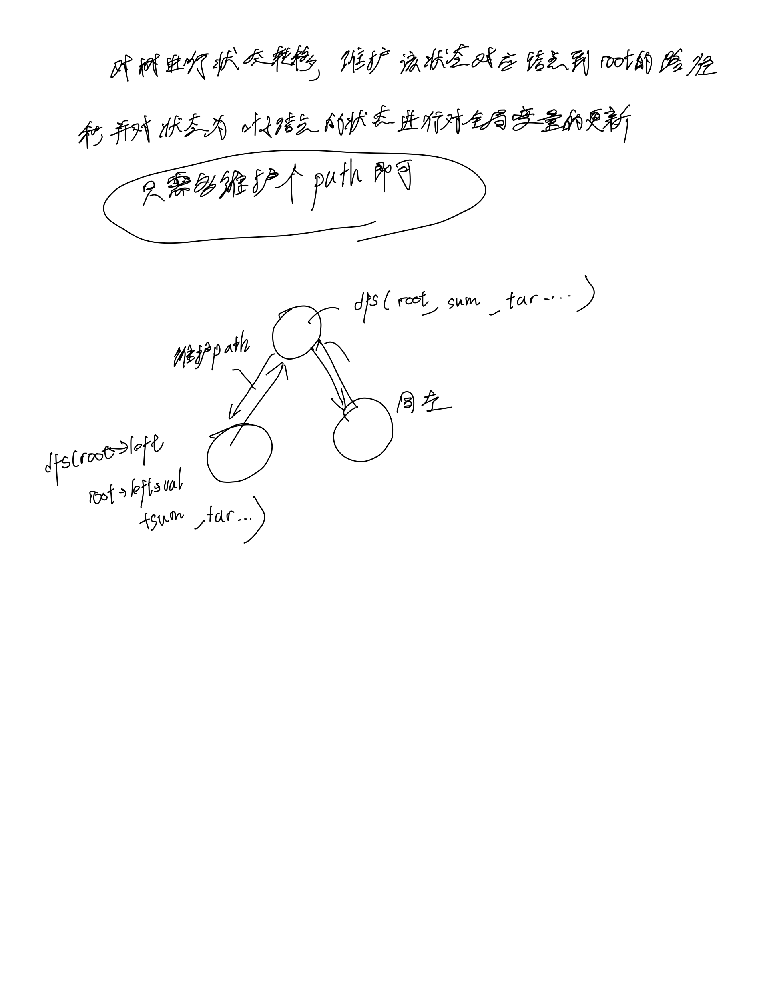

# [113. 路径总和 II](https://leetcode.cn/problems/path-sum-ii/)

## 思考



## 代码

### DFS

#### C++

```c++
/**
 * Definition for a binary tree node.
 * struct TreeNode {
 *     int val;
 *     TreeNode *left;
 *     TreeNode *right;
 *     TreeNode() : val(0), left(nullptr), right(nullptr) {}
 *     TreeNode(int x) : val(x), left(nullptr), right(nullptr) {}
 *     TreeNode(int x, TreeNode *left, TreeNode *right) : val(x), left(left), right(right) {}
 * };
 */
class Solution {
public:
    vector<vector<int>> res;
    vector<int> path;
    void dfs(TreeNode* root, int targetSum, int s) {
        if (!root->left && !root->right) {
            if (s == targetSum) {
                res.push_back(path);
            }
        }
        if (root->left) {
            path.push_back(root->left->val);
            dfs(root->left, targetSum, s + root->left->val);
            path.pop_back();
        }
        if (root->right) {
            path.push_back(root->right->val);
            dfs(root->right, targetSum, s + root->right->val);
            path.pop_back();
        }
    }
    vector<vector<int>> pathSum(TreeNode* root, int targetSum) {
        if (!root) {
            return {};
        }
        path.push_back(root->val);
        dfs(root, targetSum, root->val);
        return res;
    }
};
```

#### C

```c

```
