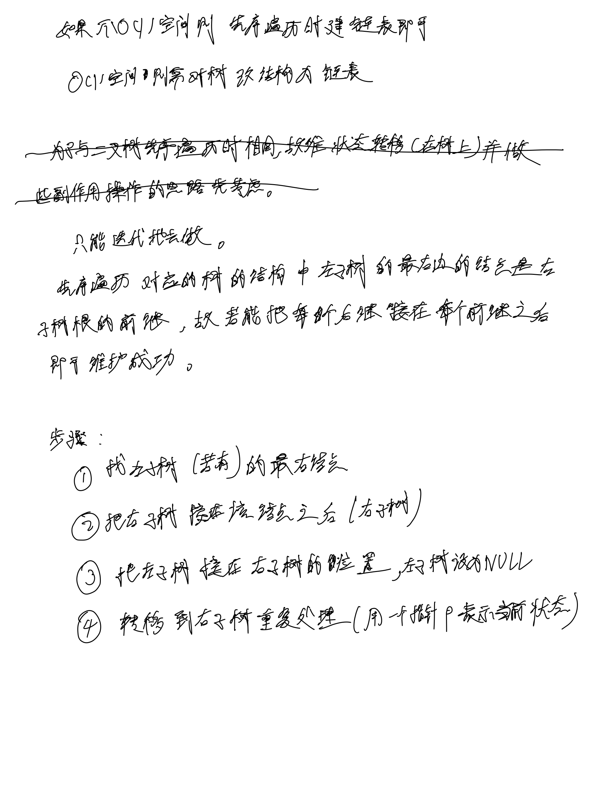

# [114. 二叉树展开为链表](https://leetcode.cn/problems/flatten-binary-tree-to-linked-list/)

## 思考



## 代码

### 状态转移(迭代)

#### C++

```c++
/**
 * Definition for a binary tree node.
 * struct TreeNode {
 *     int val;
 *     TreeNode *left;
 *     TreeNode *right;
 *     TreeNode() : val(0), left(nullptr), right(nullptr) {}
 *     TreeNode(int x) : val(x), left(nullptr), right(nullptr) {}
 *     TreeNode(int x, TreeNode *left, TreeNode *right) : val(x), left(left), right(right) {}
 * };
 */
class Solution {
public:
    void flatten(TreeNode* root) {
        // p indicates the current state
        TreeNode* p = root;
        while (p) {
            if (p->left) {
                TreeNode* t = p->left;
                while (t->right) {
                    t = t->right;
                }
                t->right = p->right;
                p->right = p->left;
                p->left = NULL;
            }
            p = p->right;
        }
    }
};
```

#### C

```c
/**
 * Definition for a binary tree node.
 * struct TreeNode {
 *     int val;
 *     struct TreeNode *left;
 *     struct TreeNode *right;
 * };
 */
void flatten(struct TreeNode* root) {
    // p indicates the current state
    struct TreeNode* p = root;
    while (p) {
        if (p->left) {
            struct TreeNode* t = p->left;
            while (t->right) {
                t = t->right;
            }
            t->right = p->right;
            p->right = p->left;
            p->left = NULL;
        }
        p = p->right;
    }
}
```
