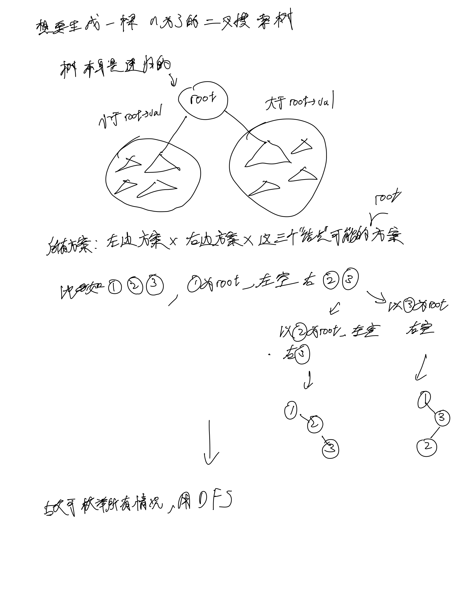
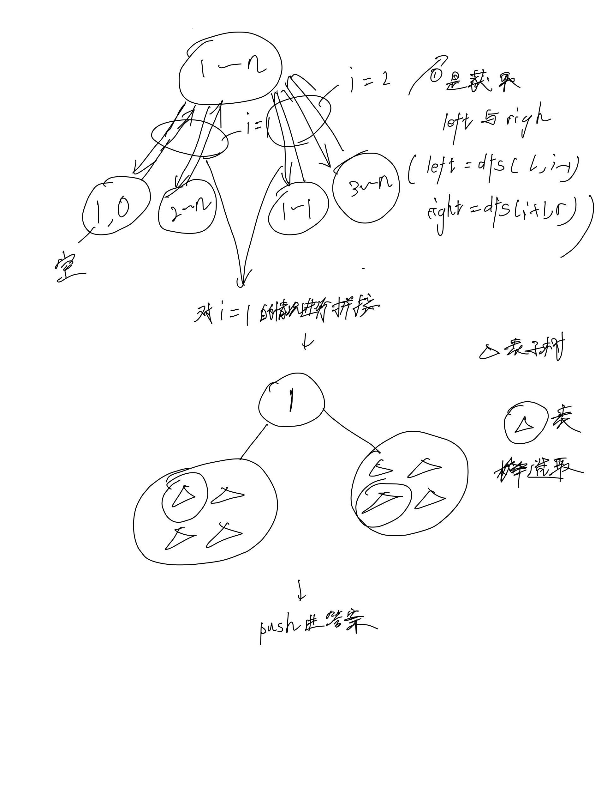

# [95. 不同的二叉搜索树 II](https://leetcode.cn/problems/unique-binary-search-trees-ii/)

## 思考




## 代码

### DFS

#### C++

```c++
/**
 * Definition for a binary tree node.
 * struct TreeNode {
 *     int val;
 *     TreeNode *left;
 *     TreeNode *right;
 *     TreeNode() : val(0), left(nullptr), right(nullptr) {}
 *     TreeNode(int x) : val(x), left(nullptr), right(nullptr) {}
 *     TreeNode(int x, TreeNode *left, TreeNode *right) : val(x), left(left), right(right) {}
 * };
 */
class Solution {
public:

    vector<TreeNode*> dfs(int l, int r) {
        if (l > r) {
            return {NULL};
        }
        vector<TreeNode*> res;

        for (int i = l; i <= r; i ++) {
            vector<TreeNode*> left = dfs(l, i - 1), right = dfs(i + 1, r);
            for (int j = 0; j < left.size(); j ++) {
                for (int k = 0; k < right.size(); k ++) {
                    TreeNode* root = new TreeNode(i);
                    root->left = left[j];;
                    root->right = right[k];
                    res.emplace_back(root);
                }
            }
        }

        return res;
    }

    vector<TreeNode*> generateTrees(int n) {
        return dfs(1, n);
    }
};
```

#### C

`/**
 * Definition for a binary tree node.
 * struct TreeNode {
 *     int val;
 *     struct TreeNode *left;
 *     struct TreeNode *right;
 * };
 */
/**
 * Note: The returned array must be malloced, assume caller calls free().
 */
struct TreeNode** dfs(int l, int r, int* returnSize) {
    if (l > r) {
        int res_sz = 0;
        struct TreeNode** res = (struct TreeNode**)malloc(sizeof(struct TreeNode*));
        res[res_sz ++] = NULL;
        *returnSize = res_sz;
        return res;
    }

    struct TreeNode** res = malloc(0);
    int res_sz = 0;
    
    for (int i = l; i <= r; i ++) {
        int left_sz = 0, right_sz = 0;
        struct TreeNode** left = dfs(l, i - 1, &left_sz), **right = dfs(i + 1, r, &right_sz);
        // DEBUG: printf("%d %d\n", left_sz, right_sz);
        res = realloc(res, sizeof(struct TreeNode*) * (res_sz + left_sz * right_sz));
        for (int j = 0; j < left_sz; j ++) {
            for (int k = 0; k < right_sz; k ++) {
                struct TreeNode* root = (struct TreeNode*)malloc(sizeof(struct TreeNode));
                root->val = i;
                root->left = left[j];
                root->right = right[k];
                //res = realloc(res, sizeof(struct TreeNode*) * (res_sz + 1));
                res[res_sz] = root;
                res_sz ++;
            }
        }
        free(left);
        free(right);
    }

    *returnSize = res_sz;
    return res;
}

struct TreeNode** generateTrees(int n, int* returnSize) {
    return dfs(1, n, returnSize);
}c
`
