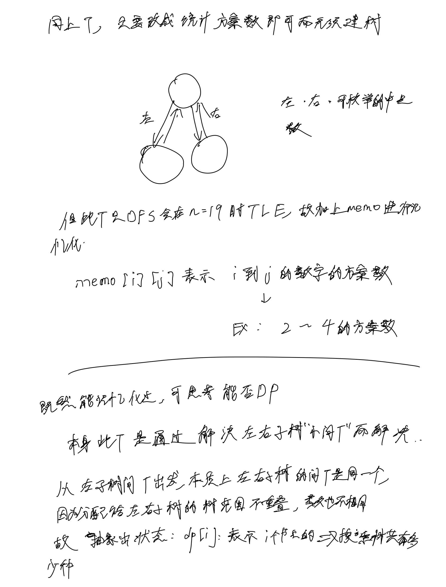
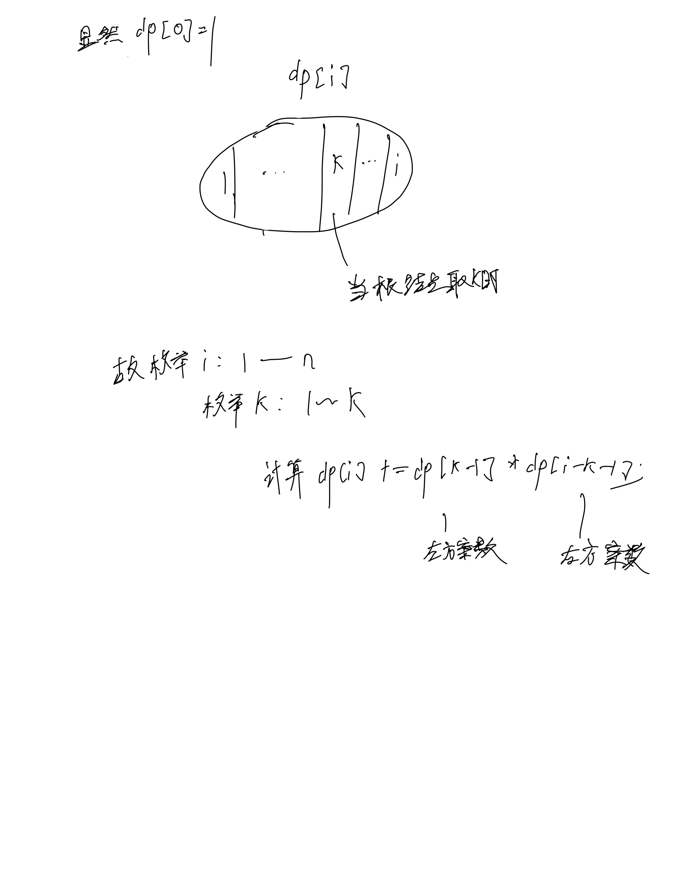

# [96. 不同的二叉搜索树](https://leetcode.cn/problems/unique-binary-search-trees/description/)

## 思考




## 代码

### DFS+记忆化

#### Cpp

```c++
#include <vector>

class Solution {
public:
    vector<std::vector<int>> memo;

    int dfs(int l, int r) {
        if (l > r) {
            return 1;
        }

        if (memo[l][r] != -1) {
            return memo[l][r];
        }

        int res = 0;
        for (int i = l; i <= r; i++) {
            int left = dfs(l, i - 1);
            int right = dfs(i + 1, r);
            res += left * right;
        }

        memo[l][r] = res;
        return res;
    }

    int numTrees(int n) {
        memo = vector<vector<int>>(n + 1, vector<int>(n + 1, -1));
        return dfs(1, n);
    }
};
```

#### C

```c
int memo[20][20];

int dfs(int l, int r) {
    if (l > r) {
        return 1;
    }

    if (memo[l][r] != -1) {
        return memo[l][r];
    }

    int res = 0;
    for (int i = l; i <= r; i ++) {
        int left = dfs(l, i - 1);
        int right = dfs(i + 1, r);
        res += left * right;
    }

    memo[l][r] = res;
    return res;
}

int numTrees(int n) {
    memset(memo, -1, sizeof memo);
    return dfs(1, n);
}
```

### DP

#### Cpp

```c++
class Solution {
public:
    vector<int> dp;
    int numTrees(int n) {
        dp = vector<int>(20, 0);
        dp[0] = 1;
        for (int i = 1; i <= n; i ++) {
            for (int k = 1; k <= i; k ++) {
                dp[i] += dp[k - 1] * dp[i - k];
            }
        }

        return dp[n];
    }
};
```

#### C

```c
int numTrees(int n) {
        int dp[20];
        memset(dp, 0, sizeof dp);
        dp[0] = 1;
        for (int i = 1; i <= n; i ++) {
            for (int k = 1; k <= i; k ++) {
                dp[i] += dp[k - 1] * dp[i - k];
            }
        }

        return dp[n];
}
```
