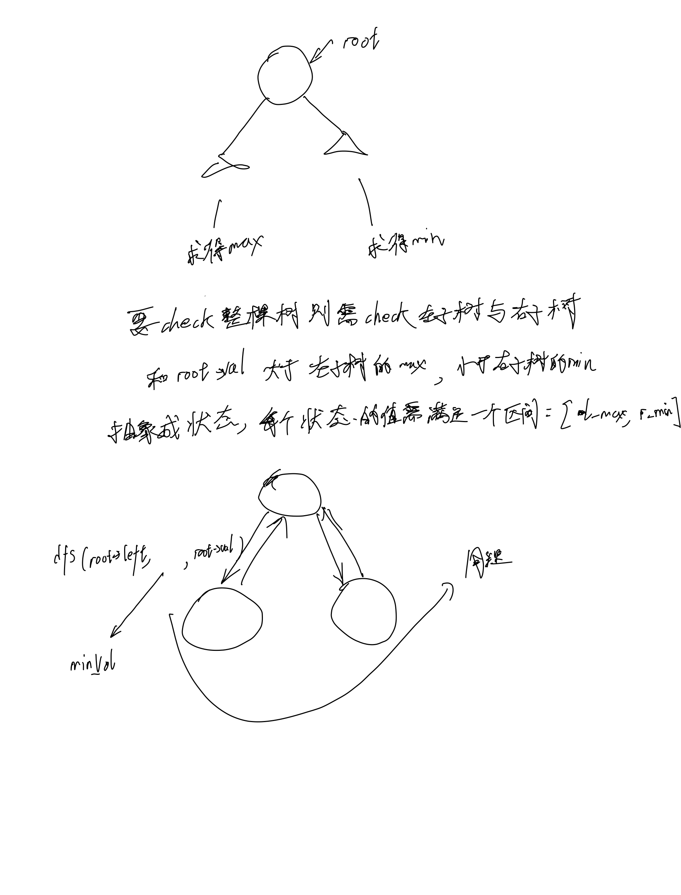

# [98. 验证二叉搜索树](https://leetcode.cn/problems/validate-binary-search-tree/description/)

## 思考



## 代码

### DFS

```c++
/**
 * Definition for a binary tree node.
 * struct TreeNode {
 *     int val;
 *     TreeNode *left;
 *     TreeNode *right;
 *     TreeNode() : val(0), left(nullptr), right(nullptr) {}
 *     TreeNode(int x) : val(x), left(nullptr), right(nullptr) {}
 *     TreeNode(int x, TreeNode *left, TreeNode *right) : val(x), left(left), right(right) {}
 * };
 */
class Solution {
public:
    bool dfs(TreeNode *root, long long l, long long r) {
        if (!root) {
            return true;
        }
        if (root->val >= r || root->val <= l) {
            return false;
        }

        if (dfs(root->left, l, root->val) && dfs(root->right, root->val, r)) {
            return true;
        }

        return false;
    }

    bool isValidBST(TreeNode* root) {
        return dfs(root, LLONG_MIN,LLONG_MAX);
    }
};
```

```c
/**
 * Definition for a binary tree node.
 * struct TreeNode {
 *     int val;
 *     struct TreeNode *left;
 *     struct TreeNode *right;
 * };
 */

bool dfs(struct TreeNode* root, long long min_val, long long max_val) {
    if (!root) {
        return true;
    }
    if (root->val <= min_val || root->val >= max_val) {
        return false;
    }

    if (dfs(root->left, min_val, root->val) && dfs(root->right, root->val, max_val)) {
        return true;
    }

    return false;
}

bool isValidBST(struct TreeNode* root) {
    return dfs(root, LLONG_MIN, LLONG_MAX);
}
```
