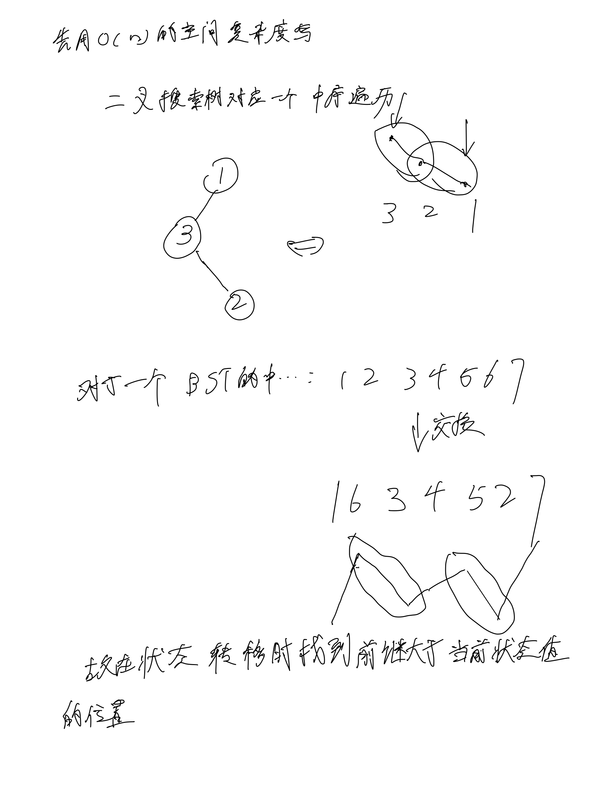
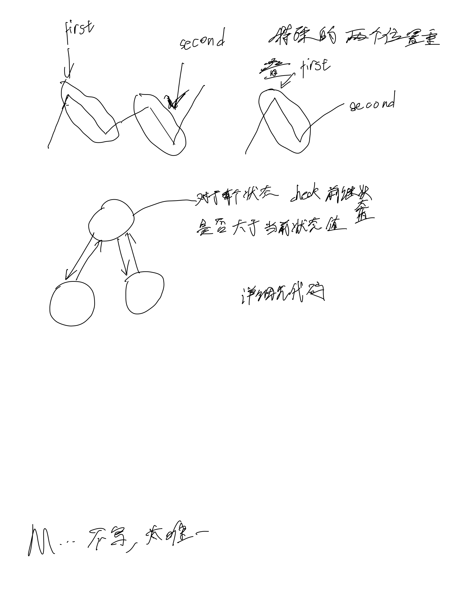

# [99. 恢复二叉搜索树](https://leetcode.cn/problems/recover-binary-search-tree/description/)

## 思考




## 代码

### DFS: O(h)

#### C++

```c++
/**
 * Definition for a binary tree node.
 * struct TreeNode {
 *     int val;
 *     TreeNode *left;
 *     TreeNode *right;
 *     TreeNode() : val(0), left(nullptr), right(nullptr) {}
 *     TreeNode(int x) : val(x), left(nullptr), right(nullptr) {}
 *     TreeNode(int x, TreeNode *left, TreeNode *right) : val(x), left(left), right(right) {}
 * };
 */
class Solution {
public:
    TreeNode* prev = NULL;
    TreeNode* first = NULL;
    TreeNode* second = NULL;

    void dfs(TreeNode* root) {
        if (root == NULL) return;

        dfs(root->left);

        if (prev != NULL && root->val < prev->val) {
            if (first == NULL) {
                first = prev;
            }
            second = root;
        }
        prev = root;

        dfs(root->right);
    }

    void recoverTree(TreeNode* root) {
        dfs(root);
        if (first != NULL && second != NULL) {
            swap(first->val, second->val);
        }
    }
};
```

### C

```c
/**
 * Definition for a binary tree node.
 * struct TreeNode {
 *     int val;
 *     struct TreeNode *left;
 *     struct TreeNode *right;
 * };
 */

struct TreeNode* prev;
struct TreeNode* first;
struct TreeNode* second;

void dfs(struct TreeNode* root) {
    if (root == NULL)
        return;

    dfs(root->left);

    if (prev != NULL && root->val < prev->val) {
        if (first == NULL) {
            first = prev;
        }
        second = root;
    }
    prev = root;

    dfs(root->right);
}

void recoverTree(struct TreeNode* root) {
    prev = NULL;
    first = NULL;
    second = NULL;
    dfs(root);
    if (first != NULL && second != NULL) {
        int val = first->val;
        first->val = second->val;
        second->val = val;
    }
}
```
