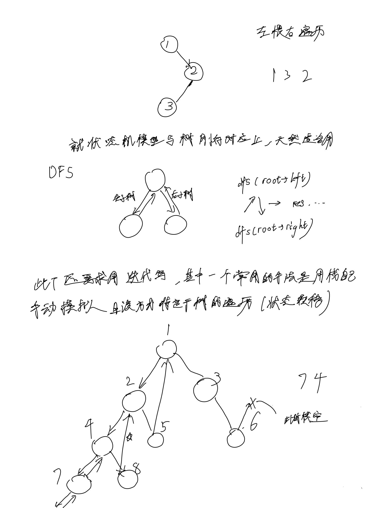
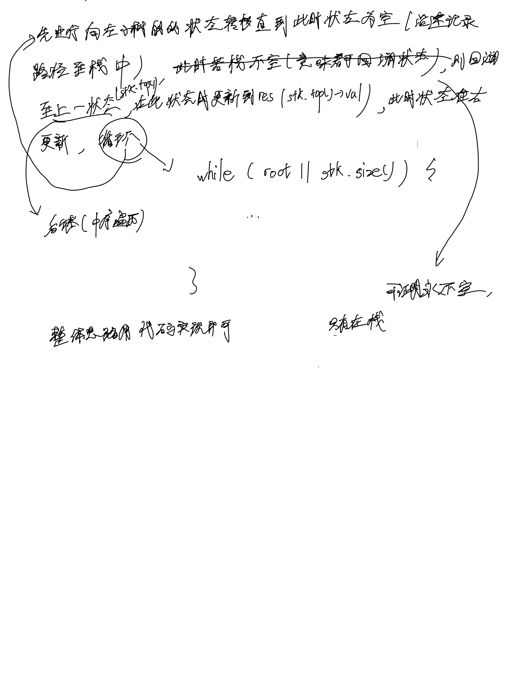

# [94. 二叉树的中序遍历](https://leetcode.cn/problems/binary-tree-inorder-traversal/description/)

## 思考




## 代码

### DFS

#### Cpp

```c++
/**
 * Definition for a binary tree node.
 * struct TreeNode {
 *     int val;
 *     TreeNode *left;
 *     TreeNode *right;
 *     TreeNode() : val(0), left(nullptr), right(nullptr) {}
 *     TreeNode(int x) : val(x), left(nullptr), right(nullptr) {}
 *     TreeNode(int x, TreeNode *left, TreeNode *right) : val(x), left(left), right(right) {}
 * };
 */
class Solution {
public:
    void dfs(TreeNode* root, vector<int> &res) {
        if (!root) {
            return;
        }
        dfs(root->left, res);
        res.emplace_back(root->val);
        dfs(root->right, res);
    }

    vector<int> inorderTraversal(TreeNode* root) {
        vector<int> res;
        dfs(root, res);

        return res;
    }
};
```

#### C

```c
/**
 * Definition for a binary tree node.
 * struct TreeNode {
 *     int val;
 *     struct TreeNode *left;
 *     struct TreeNode *right;
 * };
 */
/**
 * Note: The returned array must be malloced, assume caller calls free().
 */

int* res;
res_sz;

void dfs(struct TreeNode* root) {
    if (!root) {
        return;
    }
    dfs(root->left);
    res[res_sz] = root->val;
    res_sz ++;
    dfs(root->right);
}

int* inorderTraversal(struct TreeNode* root, int* returnSize) {
    res = (int*)malloc(sizeof(int) * 100);
    res_sz = 0;

    dfs(root);

    *returnSize = res_sz;

    return res;
}
```

### 迭代

#### C++

```c++
/**
 * Definition for a binary tree node.
 * struct TreeNode {
 *     int val;
 *     TreeNode *left;
 *     TreeNode *right;
 *     TreeNode() : val(0), left(nullptr), right(nullptr) {}
 *     TreeNode(int x) : val(x), left(nullptr), right(nullptr) {}
 *     TreeNode(int x, TreeNode *left, TreeNode *right) : val(x), left(left), right(right) {}
 * };
 */
class Solution {
public:
    vector<int> inorderTraversal(TreeNode* root) {
        vector<int> res;
        vector<TreeNode*> stk;
        TreeNode* p = root;
        while (p || stk.size()) {
            while (p) {
                stk.emplace_back(p);
                p = p->left;
            }

            TreeNode* t = stk[stk.size() - 1];
            stk.pop_back();
            p = t;
            res.emplace_back(p->val);
            p = p->right;
        }

        return res;
    }
};
```

#### C

```c
/**
 * Definition for a binary tree node.
 * struct TreeNode {
 *     int val;
 *     struct TreeNode *left;
 *     struct TreeNode *right;
 * };
 */
/**
 * Note: The returned array must be malloced, assume caller calls free().
 */
int* inorderTraversal(struct TreeNode* root, int* returnSize) {
    int* res;
    res = malloc(sizeof(int) * 100);
    int res_sz = 0;
    *returnSize = 0;
    struct TreeNode* stk[100];
    int stk_sz = 0;
    struct TreeNode* p = root;

    while (p || stk_sz) {
        while (p) {
            stk[stk_sz] = p;
            stk_sz ++;
            p = p->left;
        }

        struct TreeNode* t = stk[stk_sz - 1];
        stk_sz --;
        p = t;
        res[res_sz] = p->val;
        res_sz ++;
        p = p->right;
    }

    *returnSize = res_sz;
    return res;
}
```
