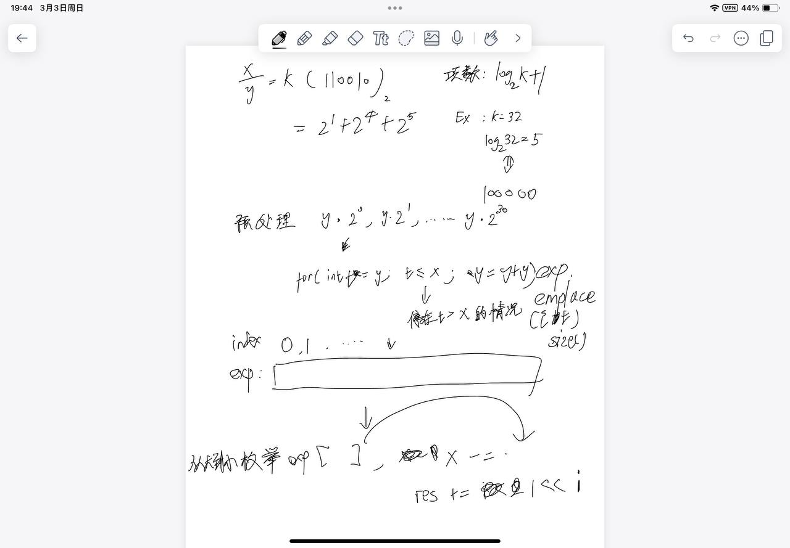

# [29. 两数相除](https://leetcode.cn/problems/divide-two-integers/)

## 思考

- 不能使用一些符号, 要条件反射位运算
- 需要清楚的是如果用减法, 假设x是2^31 - 1$, y是1, 会很慢
- 所以用类似于快速幂的方法去减
- $\frac{x}{y} = k$, k可以表示成2进制, 极端情况下k表示成2进制只会有31位
- 所以先预处理出31项$y*2^?$
- $-2^{31} <= dividend, divisor <= 2^{31 - 1}, divisor != 0$
    - 两个数都是int范围内的
    - 可以想到当被除数为$-2^{31}$, 除数为$-1$会产生$2^{31}$正溢出
    - 不会有负溢出的情况, **所以把除数和被除数转化为负数去处理就不会溢出, 之后再改变符号就行**
- 代码细节里有个判断越界
    - 当预处理exp的时候, $y * 2^?$(y是当负数处理的)会小于INT_MIN的一半, 如果不停止, 会在之后倍增的时候runtime overflow

大体的思路(结合代码):


## 代码

```c++
class Solution {
public:
    void be_minues(int& x, int& y) {
        if (x > 0) x = -x;
        if (y > 0) y = -y;
    }

    int divide(int x, int y) {
        const int HALF_INT_MIN = INT_MIN >> 1;

        bool sign = (x > 0) ^ (y > 0);
        be_minues(x, y);

        vector<pair<int, int>> exp;

        for (int t1 = y, t2 = -1; t1 >= x; t1 += t1, t2 += t2) {
            exp.emplace_back(t1, t2);
            if (t1 < HALF_INT_MIN) break;
        }

        int res = 0;
        for (int i = exp.size() - 1; i >= 0; i --) {
            if (x <= exp[i].first) {
                x -= exp[i].first;
                res += exp[i].second;
            }
        }

        if (!sign) {
            if (res == INT_MIN) return INT_MAX;
            res = -res;
        }

        return res;
    }
};
```
