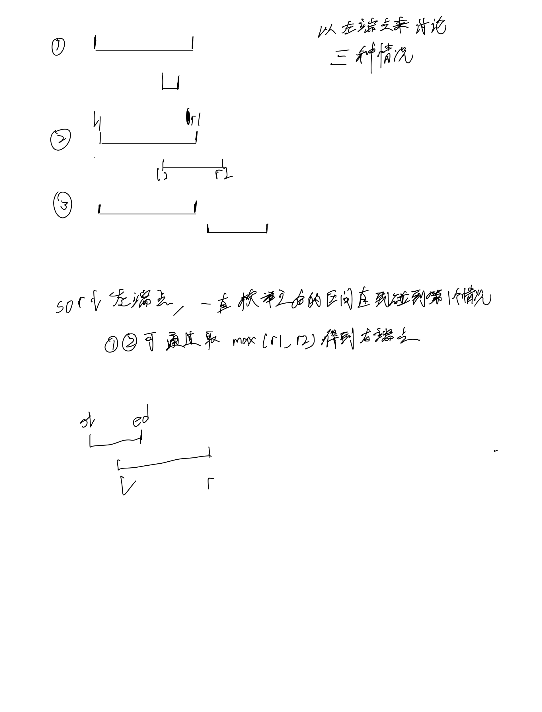

# 合并区间

## 思考



## 代码

```c++
class Solution {
public:
    vector<vector<int>> merge(vector<vector<int>>& intervals) {
        vector<vector<int>> res;
        int n = intervals.size();
        sort(intervals.begin(), intervals.end());
        int st = intervals[0][0], ed = intervals[0][1];

        for (int i = 1; i < n; i ++) {
            int l = intervals[i][0], r = intervals[i][1];
            if (ed < l) {
                res.push_back({st, ed});
                st = l, ed = r;
            } else {
                ed = max(ed, r);
            }
        }
        res.push_back({st, ed});

        return res;
    }
};
```
