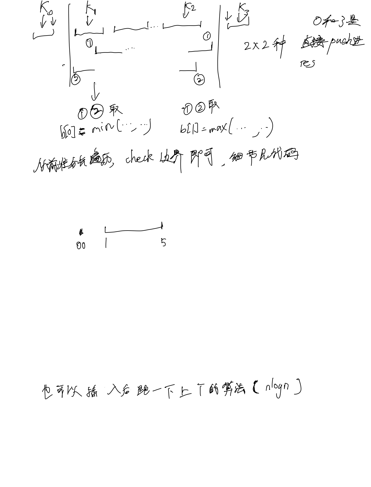

# [57. 插入区间](https://leetcode.cn/problems/insert-interval/description/)

## 思考



## 代码

```c++
class Solution {
public:
    vector<vector<int>> insert(vector<vector<int>>& a, vector<int>& b) {
        int n = a.size();
        int k = 0;
        vector<vector<int>> res;
        while (k < n && a[k][1] < b[0]) {
            res.emplace_back(a[k]);
            k ++;
        }

        // 可能会有原串空的情况
        if (k < n) {
            b[0] = min(a[k][0], b[0]);
            while (k < n && a[k][0] <= b[1]) {
                k ++;
            }
            // 主要是为了check此时k为0的时候, 前面是没有数的
            if (k) {
                b[1] = max(a[k - 1][1], b[1]);
            }
        }
        
        res.emplace_back(b);

        while (k < n) {
            res.emplace_back(a[k]);
            k ++;
        }

        return res;
    }
};
```
