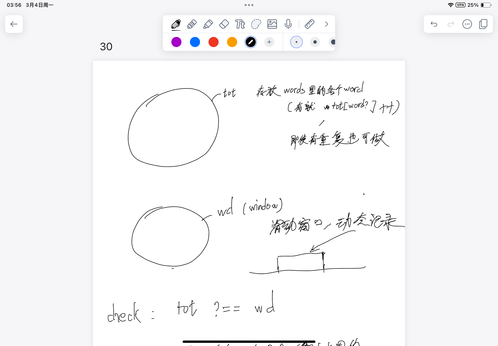
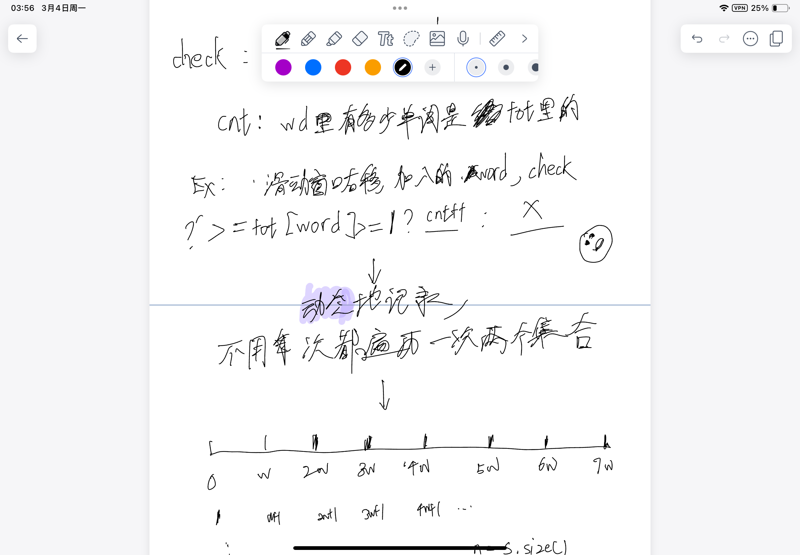
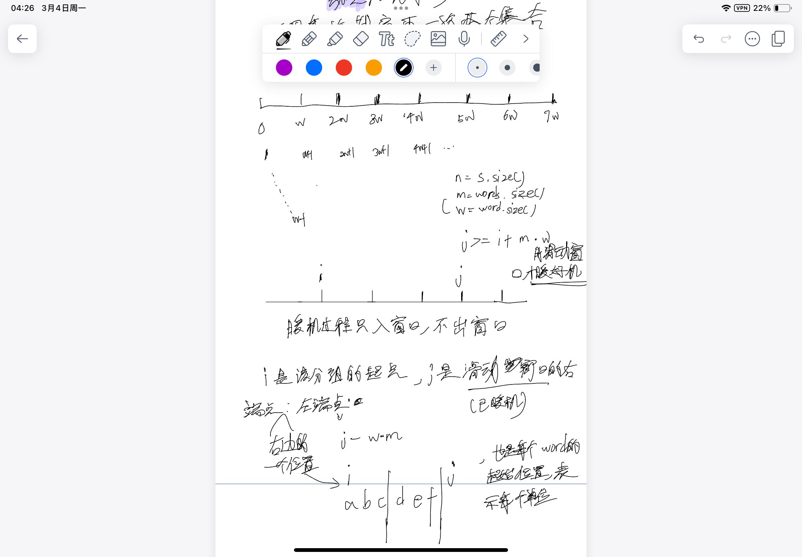
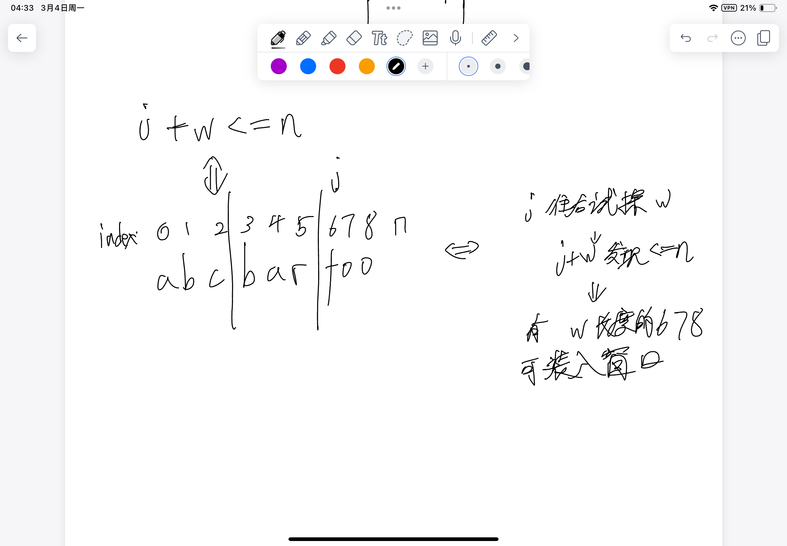

# [30. 串联所有单词的子串](https://leetcode.cn/problems/substring-with-concatenation-of-all-words/description/)

## 思路

常规的想法现在直接超时了, 时间复杂度低的方法比较不自然

- 假设每个单词的长度为w, 也就是分成$0$ - $w-1$的组
- 每组都可以以每个长度为w的单词为单位进行滑动窗口, 维持滑动窗口大小为words 中所有字符串长度, 每次动态地入窗口和出窗口
- 分别两个哈希表, 一个存储words里所有的word和个数, 一个哈希表作为滑动窗口, 一个计数器来表示wd里有多少单词(有效的)是tot里的(回避了每次遍历比较两个哈希表的时间复杂度)





---

### j >= i + w * m

这个细节是代码实现上的问题, 滑动窗口需要一个个装入单位到稳定长度(words的单词个数)

### j + w <= n的细节:



## 代码

```c++
class Solution {
public:
    vector<int> findSubstring(string s, vector<string>& words) {
        vector<int> res;
        int n = s.size(), m = words.size(), w = words[0].size();
        unordered_map<string, int> tot;
        for (string& word : words) tot[word] ++;

        for (int i = 0; i < w; i ++) {
            unordered_map<string, int> wd;
            int cnt = 0;

            // 每次check 右端点j试探j + w的位置是否超出n的位置(不存在一个word单位的开头)
            for (int j = i; j + w <= n; j += w) {
                // 暖机
                if (j >= i + w * m) {
                    string word = s.substr(j - m * w, w);
                    wd[word] --;
                    if (wd[word] < tot[word]) cnt --;
                }
                string word = s.substr(j, w);
                wd[word] ++;
                if (wd[word] <= tot[word]) cnt ++;

                if (cnt == m) res.emplace_back(j - (m - 1) * w); // m - 1注意画图去理解该循环，此时j还没有j += w, 所以要少减去个w
            }
        }
        return res;
    }
};
```
