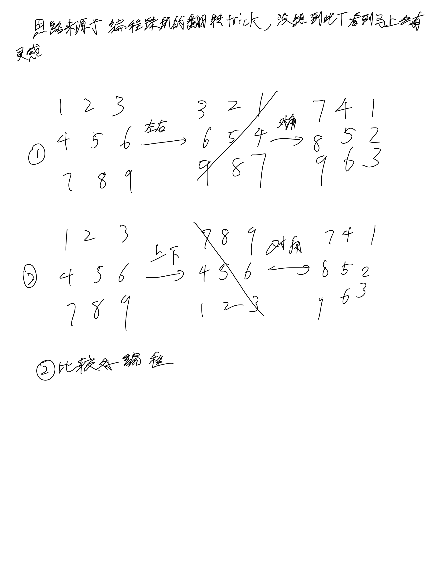

# [49. 字母异位词分组](https://leetcode.cn/problems/group-anagrams/description/)

## 思考



## 代码

```c++
class Solution {
public:
    unordered_map<string, vector<string>> mp;
    vector<vector<string>> groupAnagrams(vector<string>& strs) {
        vector<vector<string>> res;
        for(string str : strs) {
            string t = str;
            sort(str.begin(), str.end());
            mp[str].emplace_back(t);
        }

        for (pair<string, vector<string>> t : mp) {
            res.emplace_back(t.second);
        }

        return res;
    }
};
```
