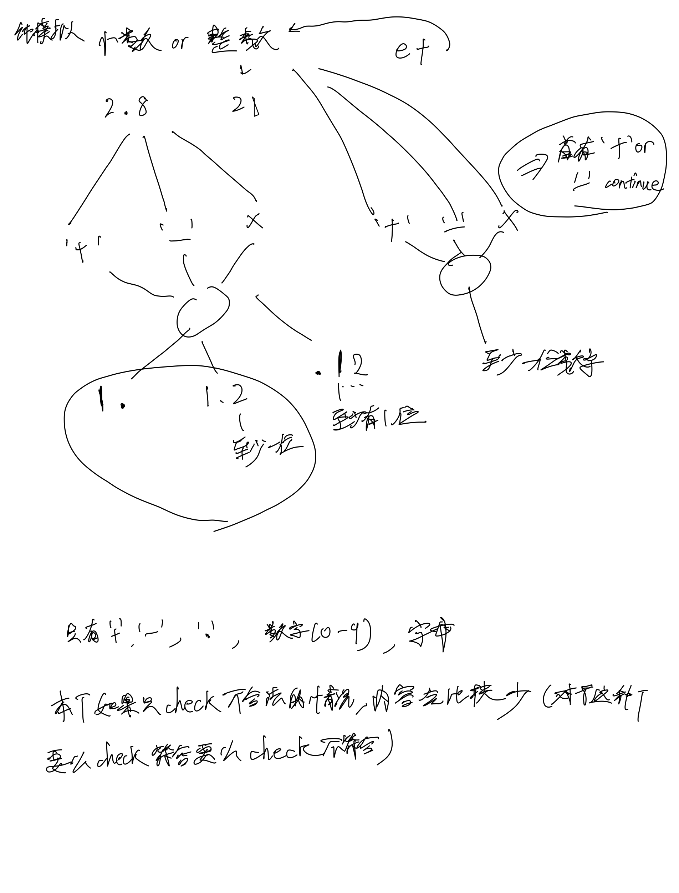
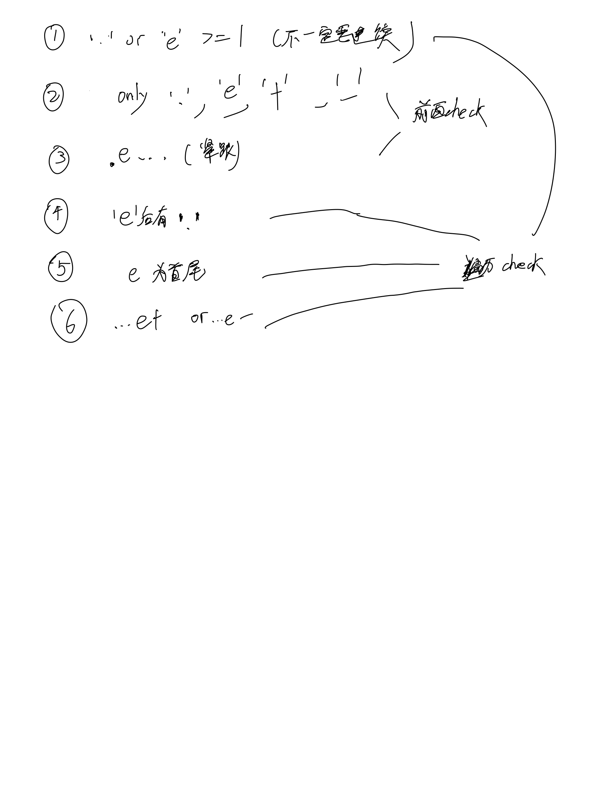

# [65. 有效数字](https://leetcode.cn/problems/valid-number/description/)

## 思考




## 代码

```c++
class Solution {
public:
    bool isNumber(string s) {
        if (s[0] == '-' || s[0] == '+') s = s.substr(1);
        if (s.empty()) return false; // 在去掉+-时为空
        if (s == "." || s == "e" || s == "E") return false;
        if (s[0] == '.' && (s[1] == 'E' || s[1] == 'e')) return false;

        int dot = 0, e = 0;
        for (int i = 0; i < s.size(); i ++) {
            if (s[i] == '.') {
                if (dot > 0 || e > 0) return false;
                dot ++;
                continue;
            }
            if (s[i] == 'e' || s[i] == 'E') {
                if (!i || i + 1 == s.size() || e > 0) return false;
                if (s[i + 1] == '+' || s[i + 1] == '-') {
                    if (i + 2 == s.size()) return false;
                    i ++; // 这条跳过+-的语句容易有问题
                }
                e ++;
                continue;
            }
            if (s[i] < '0' || s[i] > '9') {
                return false;
            }
        }

        return true;
    }
};
```
