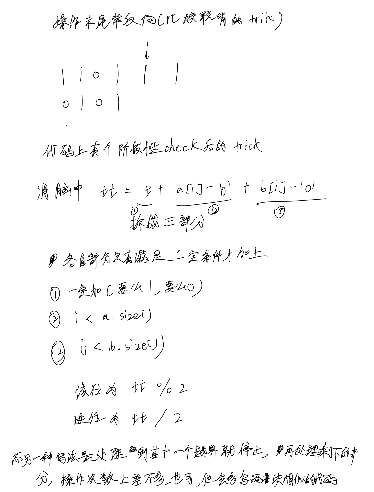

# [67. 二进制求和](https://leetcode.cn/problems/add-binary/description/)

## 思考



## 代码

```c++
class Solution {
public:
    string addBinary(string a, string b) {
        reverse(a.begin(), a.end());
        reverse(b.begin(), b.end());

        int i = 0;
        int t = 0;
        string s;
        while (i < a.size() || i < b.size() || t) {
            int tt = t;
            if (i < a.size()) tt += a[i] - '0';
            if (i < b.size()) tt += b[i] - '0';
            s += to_string(tt % 2);
            t = tt / 2;
            i++;
        }

        reverse(s.begin(), s.end());

        return s;
    }
};
```

or

```c++
class Solution {
public:
    string addBinary(string a, string b) {
        reverse(a.begin(), a.end());
        reverse(b.begin(), b.end());

        int i = 0;
        int t = 0;
        string s;
        while (i < a.size() && i < b.size()) {
            int tt = t + a[i] - '0' + b[i] - '0';
            s += to_string(tt % 2);
            t = tt / 2;
            i ++;
        }

        while (i < a.size()) {
            int tt = t + a[i] - '0';
            s += to_string(tt % 2);
            t = tt / 2;
            i ++;
        }

        while (i < b.size()) {
            int tt = t + b[i] - '0';
            s += to_string(tt % 2);
            t = tt / 2;
            i ++;
        }

        if (t) {
            s += "1";
        }

        reverse(s.begin(), s.end());

        return s;
    }
};
```
