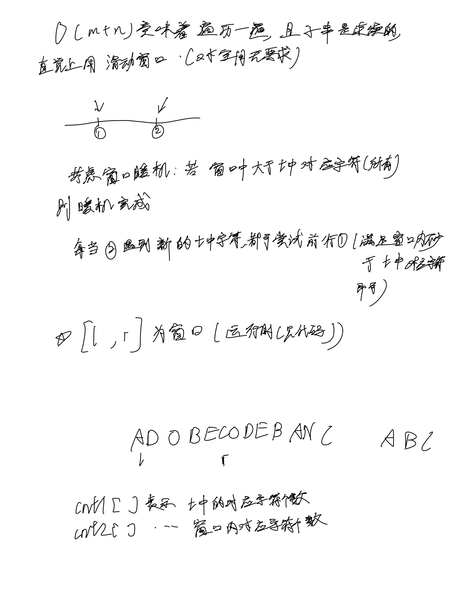
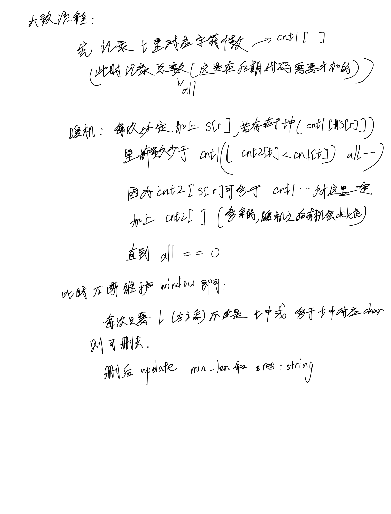

# [76. 最小覆盖子串](https://leetcode.cn/problems/minimum-window-substring/)

## 思考




## 代码

```c++
class Solution {
public:
    string minWindow(string s, string t) {
        vector<int> cnt1(128, 0); // use ASCII, cnt in string t
        vector<int> cnt2(128, 0); // window's cnt
        int n = s.size(), m = t.size();
        int all = 0;
        for (int i = 0; i < m; i ++) {
            cnt1[t[i]] ++;
            all ++;
        }

        int l = 0, r = 0, min_len = n + 1;
        string res;
        while (r < n) {
            char t = s[r];
            if (cnt1[t]) {
                if (cnt2[t] < cnt1[t])
                    all --;
                cnt2[t] ++;
            }

            // windows warm-up complete.
            if (!all) {
                // Insignificant or superfluous characters: delete
                while (!cnt1[s[l]] || cnt2[s[l]] > cnt1[s[l]]) {
                    cnt2[s[l]] --;
                    l ++;
                }
                int len = r - l + 1;
                if (len < min_len) {
                    min_len = len;
                    res = s.substr(l, len);
                }
            }

            // DEBUG: print windows in every loop
            // for (int i = l; i <= r; i ++) {
            //     cout << " " << s[i];
            // }
            // cout << endl;

            r ++;
        }

        return res;
    }
};
```
