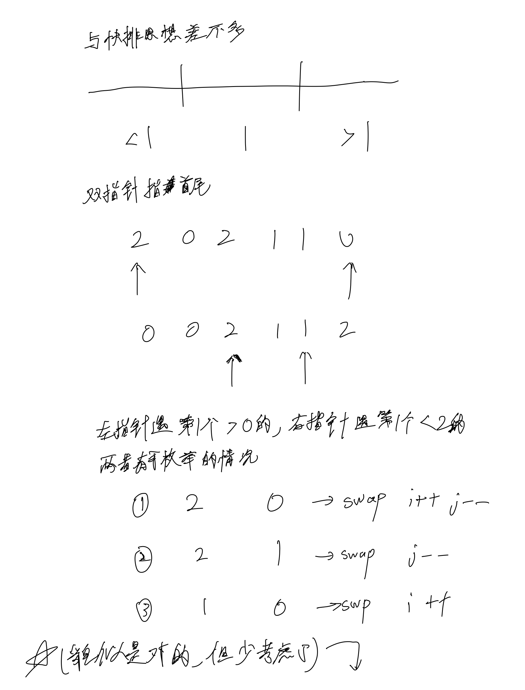
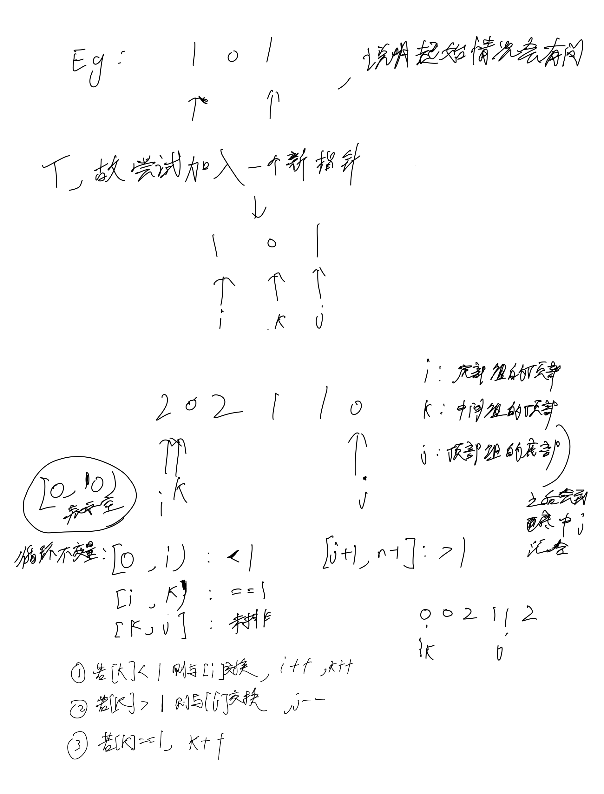

# [75. 颜色分类](https://leetcode.cn/problems/sort-colors/description/)

## 思考

- 本质: [WIKI: Dutch national flag problem荷兰国旗问题](https://en.wikipedia.org/wiki/Dutch_national_flag_problem?useskin=vector#Pseudocode)
- 这题主要是要求原地会需要这样的算法
- 而如果可以开额外O(1)的空间直接记录0, 1, 2有几个, 最后返回几个0几个1几个2就好了(桶排序)




## 代码

```c++
class Solution {
public:
    void sortColors(vector<int>& nums) {
        int n = nums.size();
        int i = 0, k = 0, j = n - 1;
        while (k <= j) {
            int &a = nums[i], &b = nums[k], &c = nums[j];
            if (b == 1) {
                k ++;
                continue;
            }
            if (b < 1) {
                swap(a, b);
                i ++, k ++;
                continue;
            }
            if (b > 1) {
                swap(b, c);
                j --;
                continue;
            }
        }
    }
};
```
