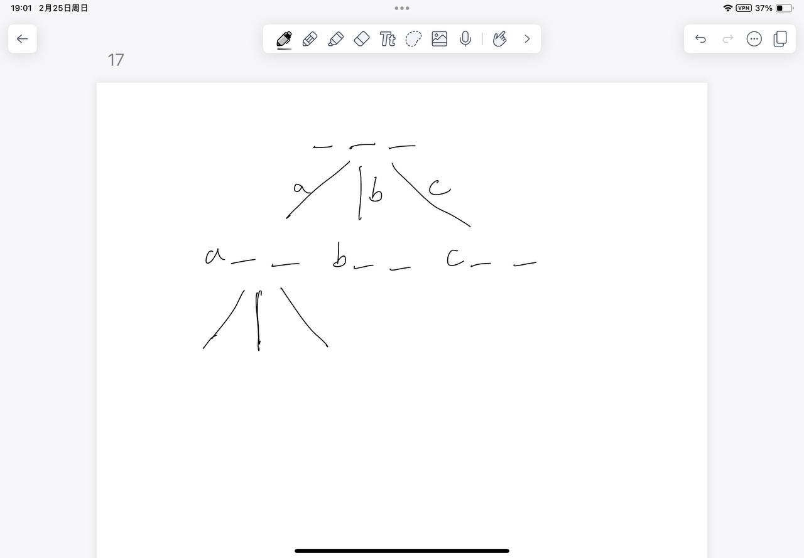

# [17. 电话号码的字母组合](https://leetcode.cn/problems/letter-combinations-of-a-phone-number/description/)

## 思考

- DFS
    - 画DFS搜索树
- `dfs(string& digits, int u, string path)`
    - u是从0开始, 指向的是要填的位置, path就是状态机的状态字符串

## 代码

```c++
class Solution {
public:
    vector<string> res;

    string strs[10] = {
        "", "", "abc", "def", "ghi", "jkl", "mno", "pqrs", "tuv", "wxyz"
    };

    void dfs(string& digits, int u, string path) {
        if (u == digits.size()) {
            res.push_back(path);
            return;
        }
        int k = digits[u] - '0';
        for (char c : strs[k]) {
            dfs(digits, u + 1, path + c);
        }
    }

    vector<string> letterCombinations(string digits) {
        if (digits == "") return res;
        dfs(digits, 0, "");
        return res;
    }
};```
