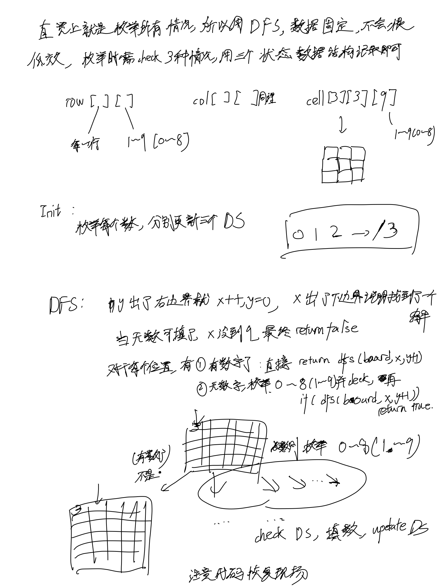

# [37. 解数独](https://leetcode.cn/problems/sudoku-solver/description/)

## 思考

- 需要注意这里有唯一解, 所以找到了一种情况马上return true就可以了
- 

## 代码

```c++
class Solution {
public:
    bool row[9][9], col[9][9], cell[3][3][9];

    bool dfs(vector<vector<char>>& board, int x, int y) {
        if (y == 9) {
            x ++, y = 0;
        }
        if (x == 9) return true;

        if (board[x][y] != '.') {
            return dfs(board, x, y + 1);     
        }

        for (int i = 0; i < 9; i ++) {
            if (row[x][i] || col[y][i] || cell[x/3][y/3][i]) continue;
            board[x][y] = i + '1';
            row[x][i] = col[y][i] = cell[x/3][y/3][i] = true;
            if (dfs(board, x, y + 1)) return true;
            board[x][y] = '.';
            row[x][i] = col[y][i] = cell[x/3][y/3][i] = false;
        }

        return false;
    }

    void solveSudoku(vector<vector<char>>& board) {
        
        memset(row, 0, sizeof row);
        memset(col, 0, sizeof col);
        memset(cell, 0, sizeof cell);
        
        for (int i = 0; i < 9; i ++) {
            for (int j = 0; j < 9; j ++) {
                if (board[i][j] != '.') {
                    int idx = board[i][j] - '1';
                    row[i][idx] = col[j][idx] = cell[i/3][j/3][idx] = true;
                }
            }
        }

        dfs(board, 0, 0);


    }
};
```
