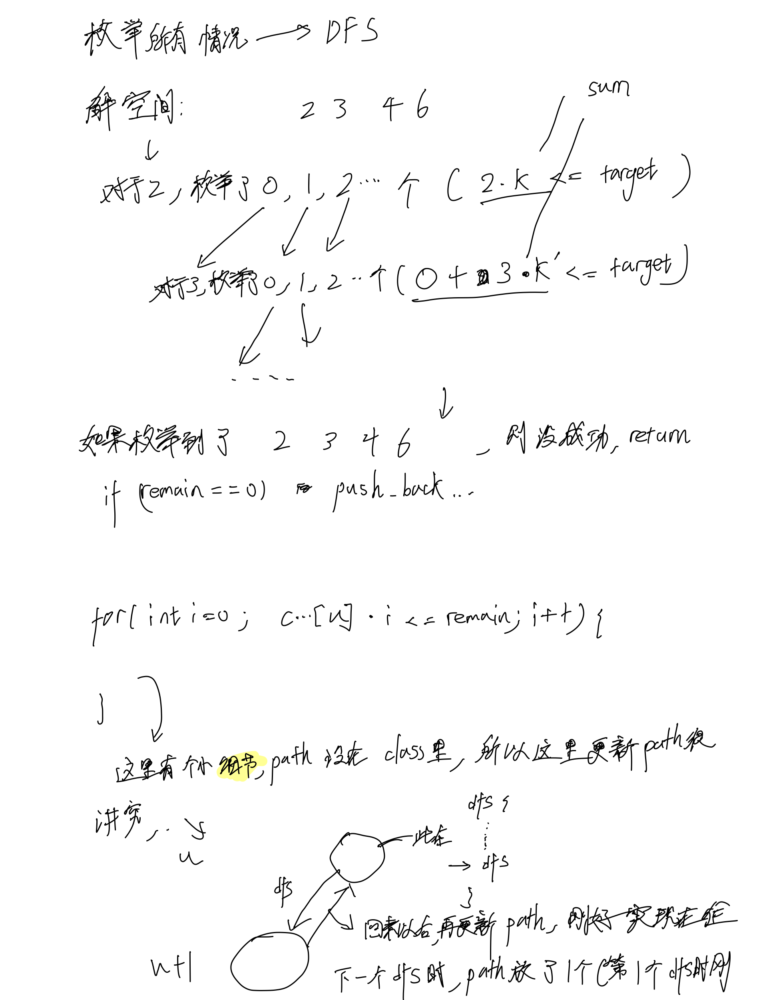
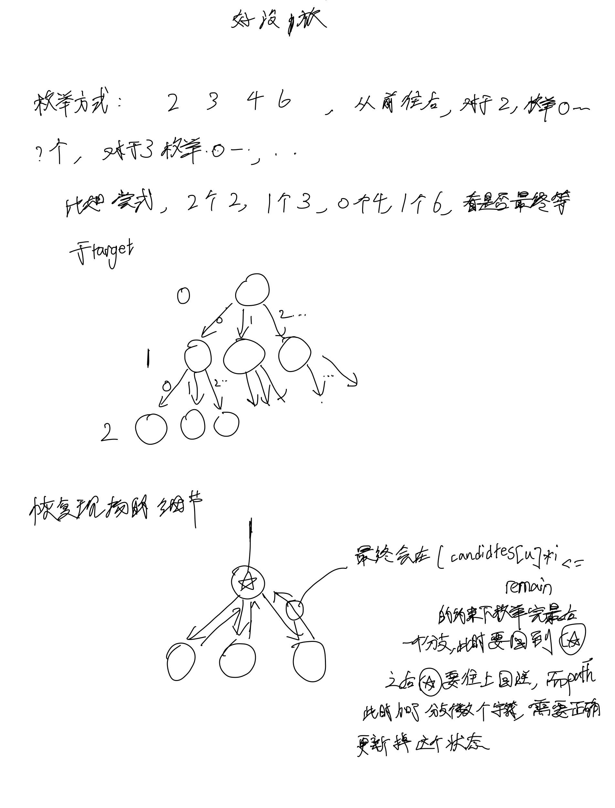

# [39. 组合总和](https://leetcode.cn/problems/combination-sum/description/)

## 思考




## 代码

```c++
class Solution {
public:
    vector<vector<int>> res;
    vector<int> path;

    void dfs(vector<int>& candidates, int u, int remain) {
        if (remain == 0) {
            res.emplace_back(path);
            return;
        }

        // 超出了可枚举的数了
        if (u == candidates.size()) {
            return;
        }

        for (int i = 0; candidates[u] * i <= remain; i ++) {
            dfs(candidates, u + 1, remain - candidates[u] * i);
            path.emplace_back(candidates[u]);
        }

        for (int i = 0; candidates[u] * i <= remain; i ++) {
            path.pop_back();
        }
    }

    vector<vector<int>> combinationSum(vector<int>& candidates, int target) {
        dfs(candidates, 0, target);

        return res;
    }
};
```
