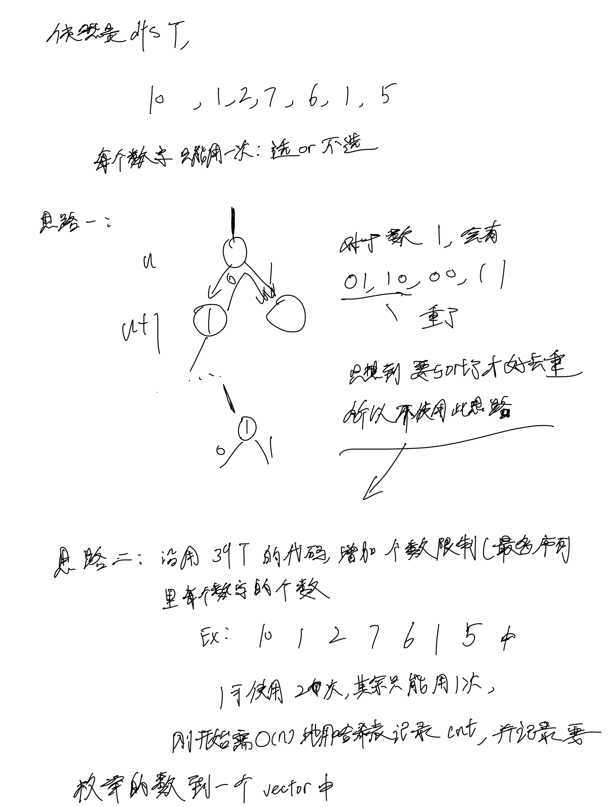

# [40. 组合总和 II](https://leetcode.cn/problems/combination-sum-ii/description/)

## 思考



## 代码

- 思路二代码

```c++
class Solution {
public:
    vector<vector<int>> res;
    vector<int> path;
    unordered_map<int, int> cnt;
    

    void dfs(vector<int>& c, int u, int remain) {
        if (remain == 0) {
            res.emplace_back(path);
            return;
        }
        if (u == c.size()) return;

        // 枚举次数
        for (int i = 0; c[u] * i <= remain && i <= cnt[c[u]]; i ++) {
            dfs(c, u + 1, remain - c[u] * i);
            path.emplace_back(c[u]);
        }

        for(int i = 0; c[u] * i <= remain && i <= cnt[c[u]]; i ++) {
            path.pop_back();
        }
    }

    vector<vector<int>> combinationSum2(vector<int>& candidates, int target) {
        vector<int> c;

        // unique(save to vector:c) and get cnt
        for (int i = 0; i < candidates.size(); i ++) {
            cnt[candidates[i]] ++;
            if (cnt[candidates[i]] == 1) {
                c.emplace_back(candidates[i]);
            }
        }
        
        dfs(c, 0, target);

        return res;
    }
};
```
