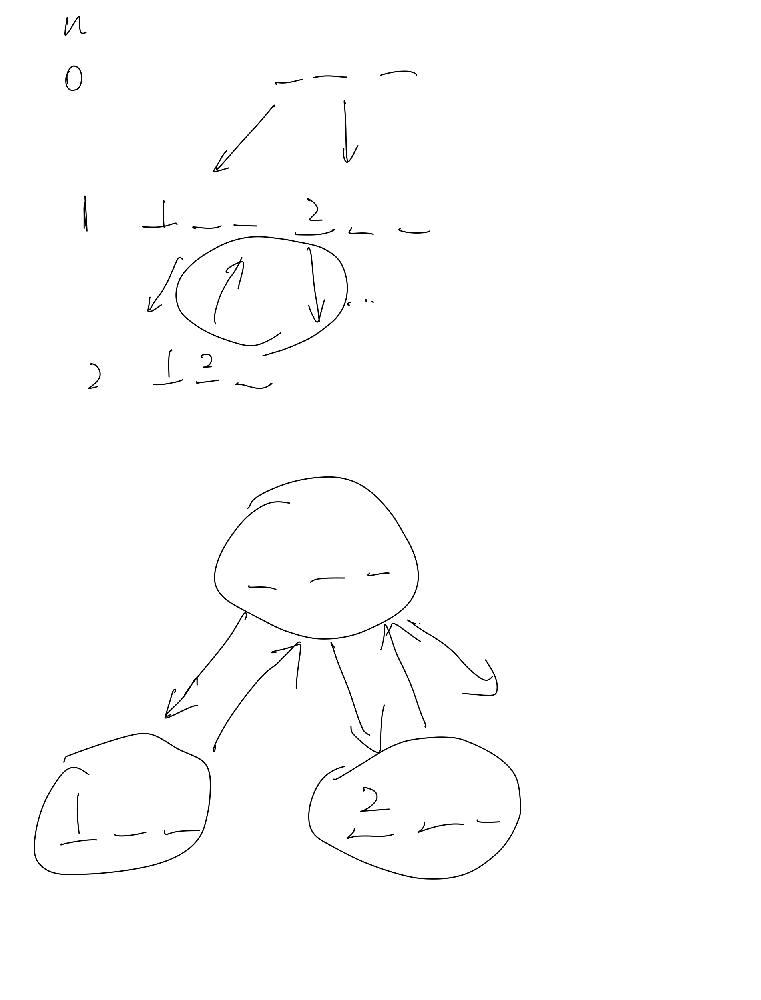

# [46. 全排列](https://leetcode.cn/problems/permutations/description/)

## 思考

- 递归搜索树+状态机思想的裸题



## 代码

```c++
class Solution {
public:
    vector<vector<int>> res;
    vector<int> path;
    bool st[10];

    void dfs(const vector<int>& nums, int u) {
        if (u == nums.size()) {
            res.emplace_back(path);
            return;
        }

        for (int i = 0; i < nums.size(); i ++) {
            if (st[i]) continue;
            st[i] = true;
            path.emplace_back(nums[i]);
            dfs(nums, u + 1);
            path.pop_back();
            st[i] = false;
        }
    }

    vector<vector<int>> permute(vector<int>& nums) {
        dfs(nums, 0);

        return res;
    }
};
```
