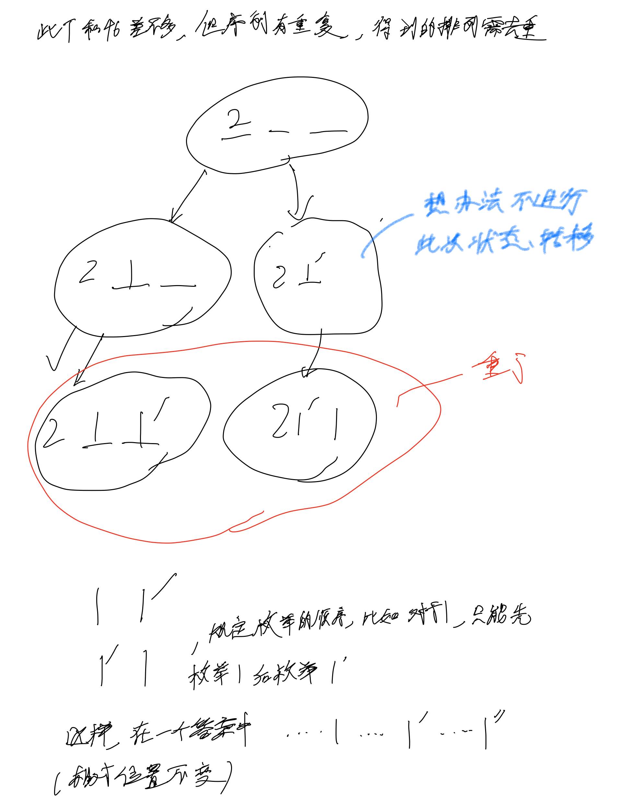
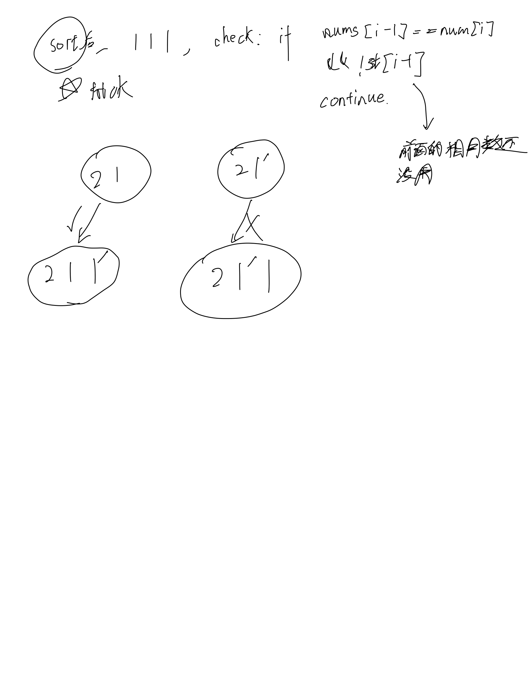

# [47. 全排列 II](https://leetcode.cn/problems/permutations-ii/description/)

## 思考




## 代码

```c++
class Solution {
public:
    vector<vector<int>> res;
    vector<int> path;
    vector<bool> st;

    void dfs(const vector<int>& nums, int u) {
        if (u == nums.size()) {
            res.emplace_back(path);
            return;
        }

        for (int i = 0; i < nums.size(); i ++) {
            if (st[i]) continue;
            if (i && nums[i - 1] == nums[i] && !st[i - 1]) continue;
            st[i] = true;
            path.emplace_back(nums[i]);
            dfs(nums, u + 1);
            path.pop_back();
            st[i] = false;
        }
    }

    vector<vector<int>> permuteUnique(vector<int>& nums) {
        sort(nums.begin(), nums.end());
        st = vector<bool>(nums.size());
        dfs(nums, 0);

        return res;
    }
};
```
