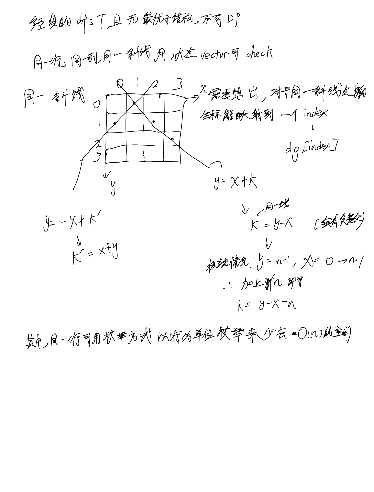
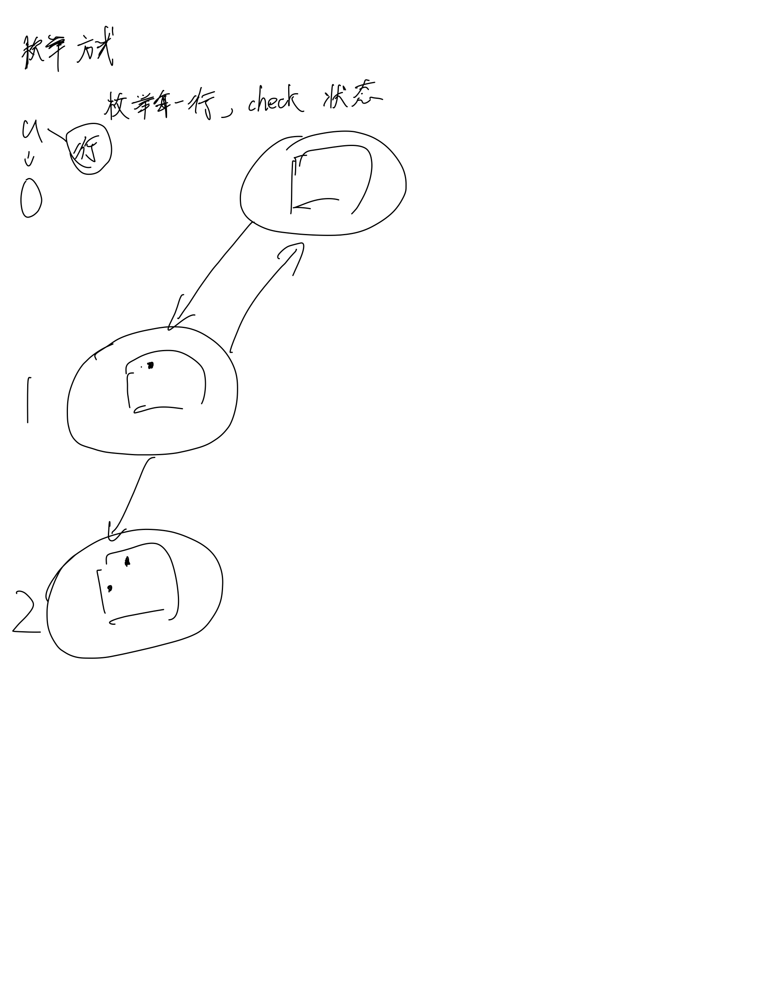

# [51. N 皇后](https://leetcode.cn/problems/n-queens/description/)

## 思考




## 代码代暧昧

```c++
class Solution {
public: 
    vector<bool> col, dg, udg;
    vector<string> path;
    vector<vector<string>> res;

    void dfs(const int& n, int u) {
        if (u == n) {
            res.emplace_back(path);
            return;
        }

        for (int i = 0; i < n; i ++) {
            if (col[i] || dg[i - u + n] || udg[u + i]) {
                continue;
            } 

            col[i] = dg[i - u + n] = udg[u + i] = true;
            path[u][i] = 'Q';
            dfs(n, u + 1);
            col[i] = dg[i - u + n] = udg[u + i] = false;
            path[u][i] = '.';
        }
    }

    vector<vector<string>> solveNQueens(int n) {
        col = vector<bool>(n, false);
        dg = vector<bool>(2 * n - 1, false);
        udg = vector<bool>(2 * n - 1, false);
        path = vector<string>(n, string(n, '.'));

        dfs(n, 0);

        return res;
    }
};
```
