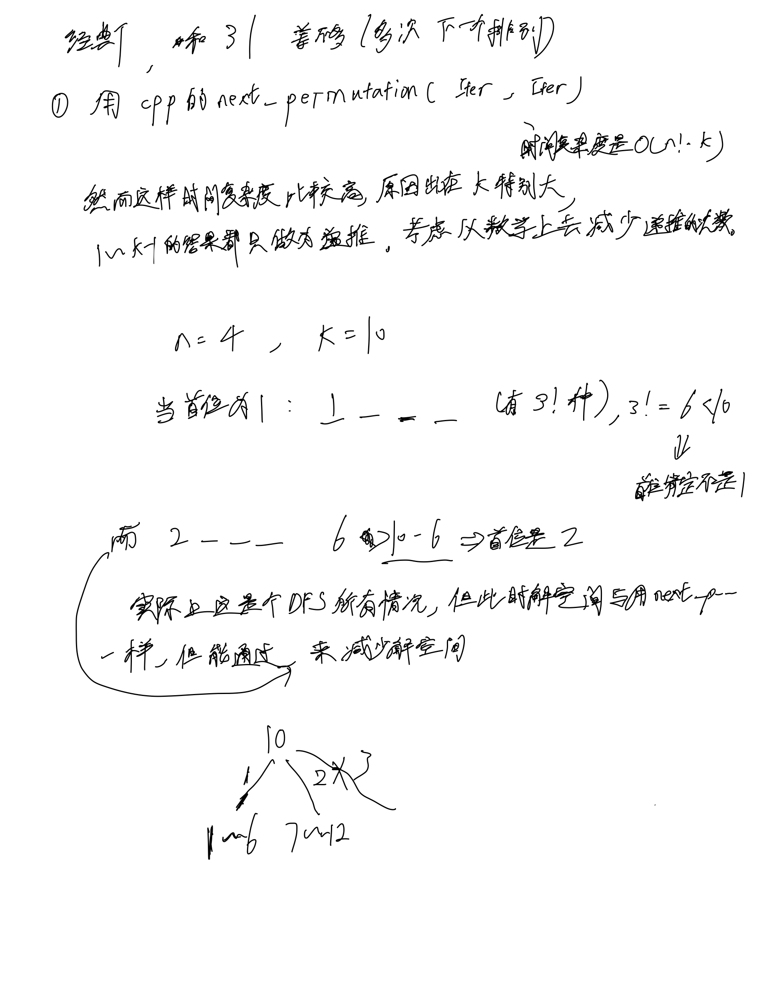
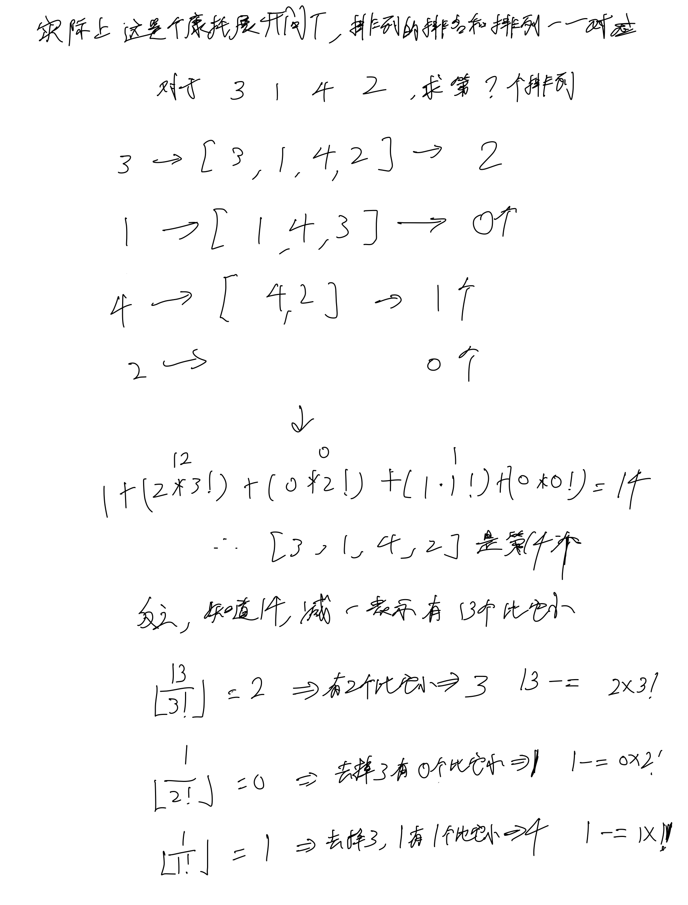

# [60. 排列序列](https://leetcode.cn/problems/permutation-sequence/description/)

## 思考





## 代码

### 用next_permutation

$O(n! * k)$

```c++
class Solution {
public:
    string getPermutation(int n, int k) {
        string s;
        for (int i = 1; i <= n; i ++) {
            s += to_string(i);
        }

        k --;
        while (k --) {
            next_permutation(s.begin(), s.end());
        }

        return s;
    }
};
```

### 逆康托展开

$O(n^2)$

```c++
class Solution {
public:
    string getPermutation(int n, int k) {
        vector<int> f(n + 1);
        
        f[1] = 1;
        vector<bool> st(n, false);
        
        for (int i = 2; i <= n - 1; i ++) {
            f[i] = f[i - 1] * i;
        }

        string s;
        k --;
        while (k) {
            for (int i = n - 1; i >= 1; i --) {
                int t = k / f[i];
                int tt = t;
                for (int j = 1; j <= n; j ++) {
                    if (st[j]) continue;
                    if (t == 0) {
                        st[j] = true;
                        s += to_string(j);
                        break;
                    }
                    t --;
                }
                k -= tt * f[i];
            }
        }

        for (int i = 1; i <= n; i ++) {
            if (!st[i]) s += to_string(i);
        }

        return s;
    }
};
```
