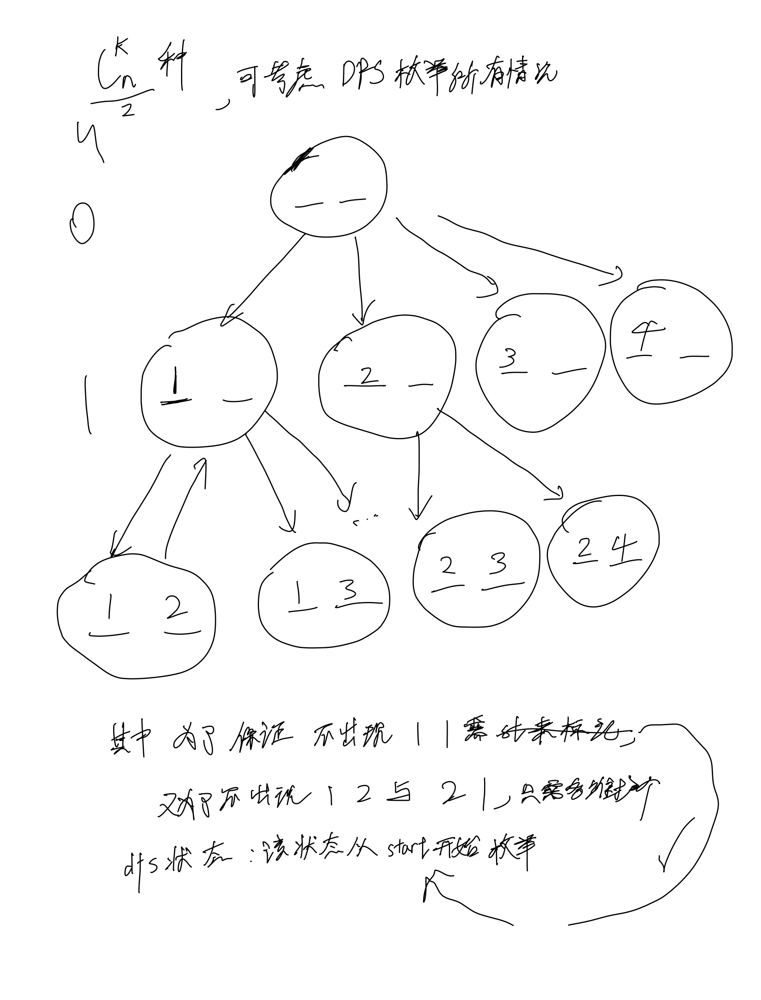

# [77. 组合](https://leetcode.cn/problems/combinations/description/)

## 思考



## 代码

```c++
class Solution {
public:
    vector<vector<int>> res;
    vector<int> path;
    void dfs(int n, int k, int u, int start) {
        if (u == k) {
            res.emplace_back(path);
            return;
        }

        for (int i = start; i <= n; i ++) {
            path.emplace_back(i);
            dfs(n, k, u + 1, i + 1);
            path.pop_back();
        }
    }

    vector<vector<int>> combine(int n, int k) {
        dfs(n, k, 0, 1);

        return res;
    }
};
```
