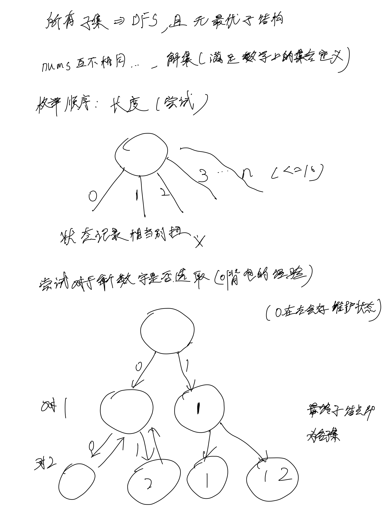
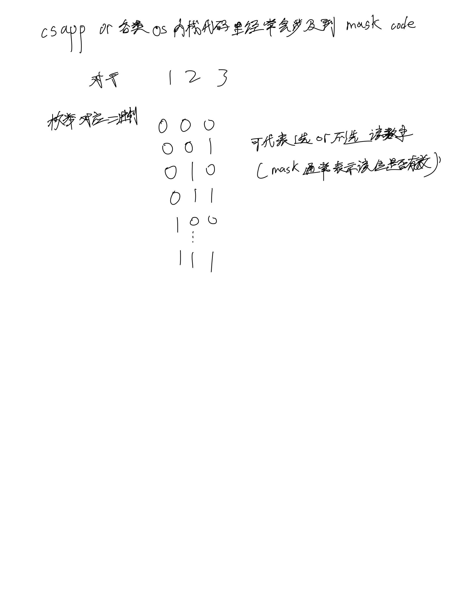

# [78. 子集](https://leetcode.cn/problems/subsets/description/)

## 思考




## 代码

### DFS

```c++
class Solution {
public:
    vector<vector<int>> res;
    vector<int> path;

    void dfs(vector<int>& nums, int n, int u) {
        if (u == n) {
            res.emplace_back(path);
            return;
        }

        dfs(nums, n, u + 1);
        
        path.emplace_back(nums[u]);
        dfs(nums, n, u + 1);
        path.pop_back();
    }
    vector<vector<int>> subsets(vector<int>& nums) {
        int n = nums.size();

        dfs(nums, n, 0);

        return res;
    }
};
```

### bit mask

```c++
class Solution {
public:
    vector<vector<int>> subsets(vector<int>& nums) {
        int n = nums.size();
        vector<vector<int>> res;
        for (int i = 0; i < 1 << n; i ++) {
            int t = i;
            vector<int> path;
            for (int j = 0; j < n; j ++) {
                if (t & 1) {
                    path.emplace_back(nums[j]);
                }
                t >>= 1;
            }
            res.emplace_back(path);
        }

        return res;
    }
};
```
