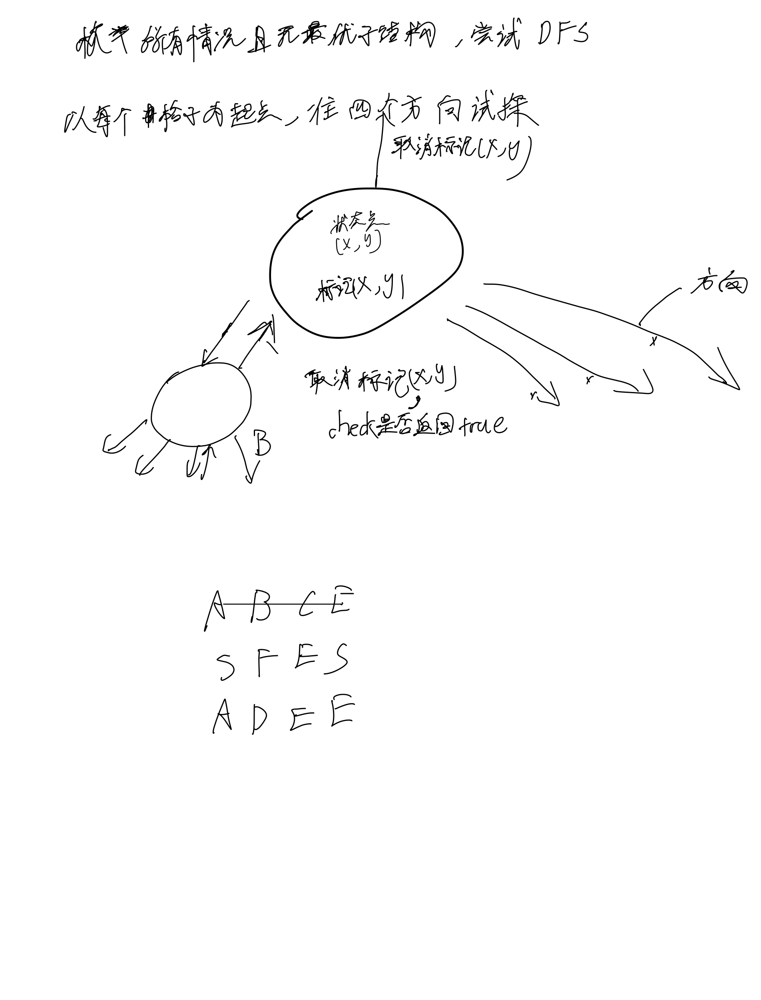

# [79. 单词搜索](https://leetcode.cn/problems/word-search/description/)

## 思考



## 代码

```c++
class Solution {
public:
    int n, m, k;
    int dx[4] = {-1, 0, 1, 0}, dy[4] = {0, 1, 0, -1};

    bool dfs(vector<vector<char>>& board, const string& word, int u, int x, int y) {
        if (board[x][y] != word[u]) {
            return false;
        }
        if (u == k - 1) {
            return true;
        }

        char t = board[x][y];
        board[x][y] = '.';
        for (int i = 0; i < 4; i ++) {
            int a = x + dx[i], b = y + dy[i];
            if (a < 0 || a >= n || b < 0 || b >= m || board[a][b] == '.') {
                continue;
            }
            if (dfs(board, word, u + 1, a, b)) {
                return true;
            }
        }
        board[x][y] = t;
        return false;
    }

    bool exist(vector<vector<char>>& board, string word) {
        n = board.size();
        m = board[0].size();
        k = word.size();

        for (int i = 0; i < n; i ++) {
            for (int j = 0; j < m; j ++) {
                if (board[i][j] != word[0]) continue;
                if (dfs(board, word, 0, i, j)) {
                    return true;
                }
            }
        }

        return false;
    }
};
```
